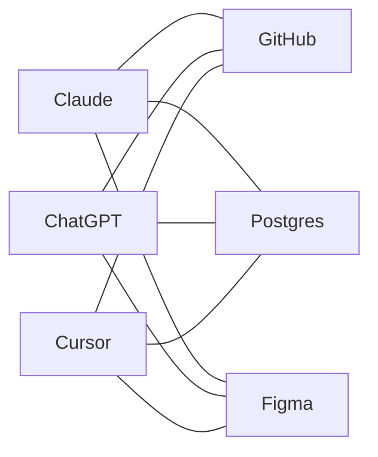
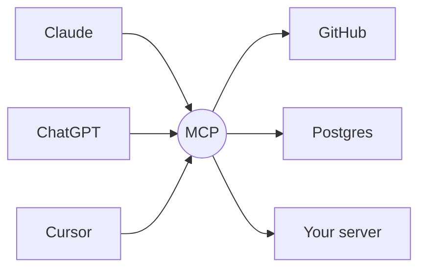
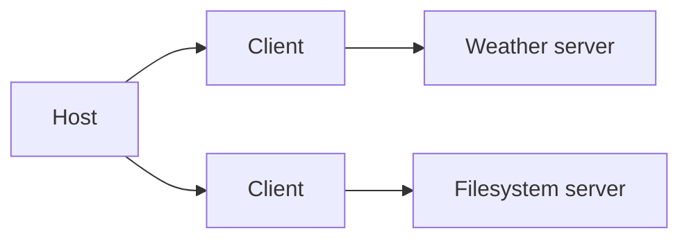

# MCP

**Model Context Protocol** — how a model reaches everything that is not in the chat.

Note: five minutes, just enough to have the same words. Whoever already writes MCP servers can look at their phone.

---

## The problem before the protocol

A model on its own can only produce text. To do anything useful it needs your data, your APIs, your files.



Every host × every service = **a custom integration each time**.

Note: the classic M×N. Each vendor invented its own plugin format, and the same GitHub connector had to be rewritten three times.

---

## The answer: one protocol in the middle



M + N. Write the server **once**, every host that speaks MCP can use it.

- open standard, introduced by Anthropic at the end of 2024
- SDKs in TypeScript, Python, Java, C#, …
- "the USB-C of AI applications" — the analogy is theirs, and it holds

---

## Who is who

| | |
| --- | --- |
| **Host** | the app with the chat: Claude Desktop, an IDE, *your* React app |
| **Client** | the piece inside the host that keeps one connection open, one per server |
| **Server** | what you write: exposes capabilities over a transport |



Note: the distinction that matters for later — **the model never talks to the server**. The host does. The model only decides *what* to ask for, and it is the host that executes, or refuses.

---

## What a server exposes

| primitive | who decides to use it | example |
| --- | --- | --- |
| **Tools** | the **model**, on its own | `get_weather`, `create_issue` |
| **Resources** | the **host / user** | a file, a record, `ui://…` |
| **Prompts** | the **user**, explicitly | a slash command, a template |

Tools are the interesting part today — but keep **resources** in mind, they come back in ten minutes.

Note: three primitives, three different owners. The confusion "resource = anything read-only" comes precisely from ignoring who pulls the trigger.

---

## A tool, all of it

```ts [1-3|5-9|11-14]
server.registerTool("get_weather", {
  description: "Current weather for a city",
  inputSchema: { city: z.string().describe("City name, e.g. 'Roma'") },
},
  async ({ city }) => ({
    content: [
      { type: "text", text: "Rome: 23°, clear sky" },
    ],
  }),
);
```

- the **description** and the `describe()` strings are the prompt: that is what the model reads to decide
- the return value is `content` — a list of blocks

Note: no parsing, no intent matching, no routing. You declare the shape, the model fills it in. Which is also why a badly written description is a bug.

---

## Transport

| | |
| --- | --- |
| **stdio** | the host spawns the server as a process — local, zero config |
| **Streamable HTTP** | the server is a remote endpoint — one URL, auth, deployable |

The demo today runs on HTTP, `localhost:3010`, because the host is a browser app.

Note: HTTP is the one that matters here — a widget in an iframe needs an origin, and stdio has none.

---

## So then

The server says what it can do. The model chooses. The host executes and gets back…

# text

Note: and this is exactly where the talk starts.
