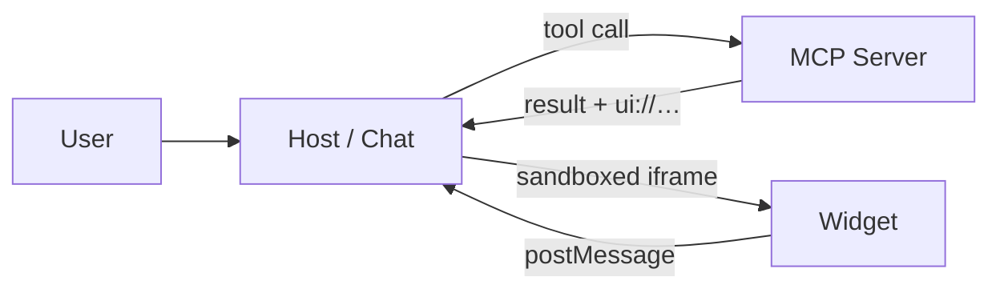

# MCP UI

From tools that answer with **text** to tools that answer with **interfaces**.

---

## The problem

An MCP tool can return exactly one thing: text. JSON at best — which the model then summarises… as text.

```json
{
  "content": [
    { "type": "text", "text": "Rome: 23°, clear sky" }
  ]
}
```

- perfect for a single value
- useless for a list, a map, a color picker
- the user can **re-read**, not **act**

Note: this is not about looks. A conversation is an extremely narrow interface: every interaction costs a full round trip through the model.

---

## The idea

Along with the result, the tool declares **a UI to render**.



The host knows nothing about the widget: it downloads it from the server and runs it **isolated**.

---

## MCP UI → MCP Apps

- **MCP UI** got there first: `@mcp-ui/server` + `@mcp-ui/client`
- the idea became **MCP Apps**, the official protocol extension
- today the `@mcp-ui/*` packages are the **reference implementation** of that spec

```json [2-4|5-6]
{
  "@mcp-ui/server": "^6.1.0",
  "@mcp-ui/client": "^7.1.1",
  "@modelcontextprotocol/ext-apps": "^1.7.5",
  "@modelcontextprotocol/sdk": "^1.30.0"
}
```

Note: `ext-apps` is the official MCP package; `@mcp-ui/*` builds on it. The demo uses both: `createUIResource` from mcp-ui, `registerAppTool` / `registerAppResource` from ext-apps.

---

## The three pieces

| | |
| --- | --- |
| **Server** | exposes the tool **and** the UI resource (`@mcp-ui/server`) |
| **Host** | calls the tool and mounts the widget (`@mcp-ui/client`) |
| **Widget** | HTML/JS running inside a sandboxed iframe |

The widget cannot touch the host's DOM, the host's network, or the model.
It only speaks `postMessage`.

---

## The smallest possible widget

One inline HTML string. No file, no build, no framework.

```ts [1|3|5-9]
import { createUIResource } from "@mcp-ui/server";

const htmlString = `<h1>Hello from MCP UI 👋</h1>`;

const helloUI = createUIResource({
  uri: "ui://hello-server/inline-hello",
  encoding: "text",
  content: { type: "rawHtml", htmlString },
});
```

That's a complete UI resource: the host can already mount it in a sandboxed iframe.

Note: this is the whole trick in five lines — a string of HTML wrapped in an MCP resource with a `ui://` URI. A static `<h1>` needs nothing else: no handshake, no postMessage, no JS at all. Everything that follows (files on disk, tool data, the `App` class) is this, plus layers.

---

## UIResource

The basic unit: an MCP resource under the `ui://` scheme.

```ts [1|3-4|5-9]
import { createUIResource } from "@mcp-ui/server";

const helloUI = createUIResource({
  uri: "ui://hello-server/hello-template",
  encoding: "text",
  content: {
    type: "rawHtml",
    htmlString,
  },
});
```

Note: encoding "text" means plain HTML, "blob" means base64. There is also an `adapters` option: it injects a compatibility shim for widgets written against **other** protocols (the legacy MCP-UI postMessage messages, or ChatGPT's Apps SDK). A widget that speaks native MCP Apps — like all of ours — doesn't need it.

---

## Three ways to ship the UI

| `type` | what you send | when |
| --- | --- | --- |
| `rawHtml` | an HTML string | self-contained widgets, zero build |
| `externalUrl` | a URL in an iframe | a real app, already deployed |
| `remoteDom` | a script that builds DOM | UI that inherits the host's theme |

```ts
content: { type: "externalUrl", iframeUrl: "https://www.fabiobiondi.dev" }
```

Note: every example here uses rawHtml, read from an .html file sitting next to the tool — you edit it like an ordinary page.

---

## Binding the tool to the UI

Two registrations and one `_meta`.

```ts [1-6|8-14|11-13]
// 1. the resource: the host fetches it with resources/read
registerAppResource(server, "hello_world_ui", helloUI.resource.uri,
  { _meta: { ui: { resourceUri: helloUI.resource.uri } } },
  async () => ({ contents: [helloUI.resource] }),
);

// 2. the tool: says WHERE its UI lives
registerAppTool(server, "hello_world", {
  description: "Shows a minimal 'Hello world' widget…",
  inputSchema: { name: z.string().optional() },
  _meta: { ui: { resourceUri: helloUI.resource.uri } },
}, handler);
```

`_meta.ui.resourceUri` is the whole link.

Note:
- these are **two different MCP primitives**: a resource and a tool. MCP UI invents nothing new, it just ties them together
- the resource is an ordinary resource that happens to use a `ui://` URI: the host fetches it with `resources/read` exactly like any other
- the `_meta` goes in **both places**. On the resource it says "I am a UI", on the tool it says "my UI is over there". If the two URIs don't match character for character the host finds nothing and silently falls back to text — the most annoying failure mode there is
- the second argument (`"hello_world_ui"`) is the **name** for the host, not the URI: two distinct identifiers. In the demo's weather tool it is called `weather_dashboard_ui2`, left over from renames during development — it changes nothing
- host-side the order is `tools/list` → sees the `_meta` → `resources/read` → mounts the iframe. The resource is fetched once and reused: **N tools can point at the same UI**
- `registerAppTool` / `registerAppResource` come from `@modelcontextprotocol/ext-apps`, not from mcp-ui: thin wrappers over `registerTool` / `registerResource` that take care of the `_meta`. You can do it by hand
- we read the HTML with `readFileSync` **once**, at registration time: the widget is not rebuilt on every call (in dev `tsx watch` restarts the server for you)
- the point worth saying out loud: a host that knows nothing about MCP Apps ignores the `_meta` and still gets the textual `content`. **The tool keeps working everywhere** — you are adding a layer, not breaking compatibility

---

## What the host does

1. calls the tool
2. sees `_meta.ui.resourceUri` in the tool definition
3. fetches the resource with `resources/read`
4. mounts it in a sandboxed iframe and hands it the data

```tsx [2-6|7-8]
<AppRenderer
  client={client}
  toolName={toolData.name}
  toolInput={toolData.input}
  toolResult={toolData.result}
  sandbox={sandbox}
  onMessage={…}
  onSizeChanged={…}
/>
```

---

## The handshake

The widget doesn't hand-roll postMessage: the **`App` class** speaks the protocol for it.

```js [1|3|5-8|10-11]
import { App } from "@modelcontextprotocol/ext-apps";

const app = new App({ name: "hello-widget", version: "1.0.0" });

app.ontoolinput = ({ arguments: args }) => { /* the model's input */ };
app.ontoolresult = (result) => {
  // result.structuredContent, result.isError
};

// ui/initialize handshake — callbacks BEFORE connect()
await app.connect();
```

Note: `connect()` performs the `ui/initialize` handshake over postMessage with the host; after that the host pushes `ui/notifications/tool-input` and `ui/notifications/tool-result`. Order still matters — register the callbacks before `connect()`, or the first notifications land in the void. In the demo the iframe imports the class from the MCP server itself (`http://localhost:3010/ext-apps.js`, the `app-with-deps` bundle shipped in the package), so the talk doesn't depend on the network. The old hand-rolled protocol (`ui-lifecycle-iframe-ready` / `render-data`) is deprecated — if you meet it, that's what the `adapters` shim translates.

---

## From the widget outwards

Every `App` method is JSON-RPC over `postMessage` underneath.

| call | wire method | effect |
| --- | --- | --- |
| `app.sendMessage(…)` | `ui/message` | writes into the conversation, the model replies |
| `app.sendSizeChanged(…)` | `ui/notifications/size-changed` | asks the host to resize it |
| `app.openLink(…)` | `ui/open-link` | opens a URL |
| `app.callServerTool(…)` | `tools/call` | calls an MCP tool |
| `app.request({ method: "x/…" })` | *custom* | lands in `onFallbackRequest`: drives **the host app** |

Note: the first four are standard. The last one is the side door — the host decides what it accepts.

---

## Sandbox

- the widget runs in an iframe with `allow-scripts` and **without** `allow-same-origin`
- the sandbox proxy is served from a **different origin** than the app
- no cookies, no storage, no host DOM

```ts
const sandbox = useMemo(
  () => ({ url: new URL("http://localhost:3010/sandbox_proxy.html") }),
  [],
);
```

Note: cross-origin isn't pedantry — it is the recommended setup, and it also works around a Chrome bug in WindowProxy identity between same-origin iframes.
