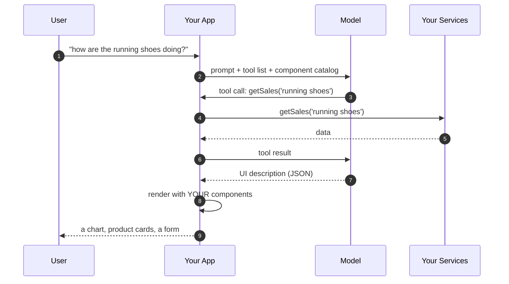
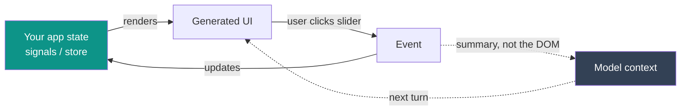

<div class="mockup-frame">
  <iframe src="https://stage.mokup.dev/embed/95ff8eab-3c34-4eaf-9f53-e263ee1c6062" width="800" height="500" style="border:0;" allowfullscreen></iframe>
</div>

Note: same chat, same question, same data. On the left the model answers with a paragraph; on the right it answers with an interface. Scroll the mockup live if the room wants to see the rest — everything after this slide is about how the right-hand side is built.

---

## Every screen you have ever shipped…

# …was designed **before** you knew the question

Note: ask the room: how many screens in your app exist only because of one edge case? The filter panel nobody uses. The 12 tabs. The dashboard with 40 widgets because we could not decide which 6 mattered.

---


## The problem we actually have

- We design **one UI for every user**, then hide 90% of it behind filters, tabs and menus
- Every new use case = a new screen, a new route, a new sprint
- The user knows what they want — they just can't **say** it to a form
- Search boxes return links. Dashboards return everything. Neither returns *an answer*

<p class="fragment">Chat solved the <b>input</b> problem.<br>It gave us back a <b>wall of text</b> as output.</p>

Note: this is the setup for the whole talk. Chat was a huge UX regression in one specific way: we replaced rich, clickable, scannable interfaces with a paragraph. Generative UI is the attempt to get the interface back without going back to the static screen.

---

## Text is a terrible output format

<div style="display: flex; gap: 2.5rem; align-items: flex-start;">
  <div style="flex: 1;">
    <p><strong>What the model says</strong></p>
    <blockquote>Running shoes made €6,700 this month, up 12% on last month. Week one was €1,200, week two €1,810, week three €1,640 and week four €2,050. Your last order, A-99213, was delivered on the 14th.</blockquote>
    <p style="font-size: 0.7em; opacity: 0.7;">To compare two of those weeks — or to report that order — the user must now <b>type another sentence</b>, and wait for another paragraph.</p>
  </div>
  <div style="flex: 1;">
    <p><strong>What the user needs</strong></p>
    <div style="padding: 1em 1.2em; border: 1px solid rgba(148, 163, 184, 0.4); border-radius: 8px;">
      <div style="font-size: 0.75em; opacity: 0.75;">Running shoes — revenue, by week</div>
      <div style="display: flex; align-items: flex-end; gap: 0.8rem; height: 130px; margin: 0.8em 0 0.4em;">
        <div style="flex: 1; height: 59%; background: #14b8a6; border-radius: 4px 4px 0 0;"></div>
        <div style="flex: 1; height: 88%; background: #14b8a6; border-radius: 4px 4px 0 0;"></div>
        <div style="flex: 1; height: 80%; background: #14b8a6; border-radius: 4px 4px 0 0;"></div>
        <div style="flex: 1; height: 100%; background: #14b8a6; border-radius: 4px 4px 0 0;"></div>
      </div>
      <div style="display: flex; gap: 0.8rem; font-size: 0.65em; opacity: 0.7;">
        <div style="flex: 1; text-align: center;">1200</div>
        <div style="flex: 1; text-align: center;">1810</div>
        <div style="flex: 1; text-align: center;">1640</div>
        <div style="flex: 1; text-align: center;">2050</div>
      </div>
      <div style="margin-top: 1em; padding: 0.5em 0.9em; border: 1px solid #14b8a6; border-radius: 6px; font-size: 0.8em; display: inline-block;">Download PDF</div>
    </div>
    <p style="font-size: 0.7em; opacity: 0.7;">One chart, one button. Zero sentences.</p>
  </div>
</div>

Note: this is the single slide that explains the whole idea. Same information, same model, same tool call — the difference is only what we do with the result. Keep this one on screen a few seconds longer than feels comfortable. The numbers here are the exact ones that come back as JSON three slides from now — say that when you get there.

---

## One definition, and one anti-definition

> **Generative UI** — the model does not produce the interface.
> It produces a **description** of an interface, using components *you* wrote, and your app renders it.

<blockquote class="fragment"><b>It is <i>not</i>:</b> an LLM emitting raw HTML/CSS/JS that you <code>innerHTML</code> into the page.<br>That is a security incident with a nice demo.</blockquote>

<p class="fragment" style="text-align: center;"><b>The model picks from a menu. It does not cook.</b></p>

Note: "the model picks from a menu, it does not cook" — this is the line I want people to repeat at the coffee break. Everything else in the talk is a consequence of it.

---

## Three things an LLM can do for you

**1. Generate text** — the thing everybody knows. Useful, unstructured, unrenderable.

```txt
"Running shoes made €6,700 this month, up 12% on last month."
```

**2. Generate structured output** — you hand it a schema, you get back valid JSON. Every time.

```json
{ "metric": "revenue", "groupBy": "week",
  "series": [{ "label": "Running shoes", "points": [1200, 1810, 1640, 2050] }] }
```

**3. Call your functions** — "tools". You describe what your app can do; the model decides *when* to call it. Your code still runs the logic.

```ts
tools: [ getSales, getProducts, getOrder, createTicket ]
```

<p class="fragment">Generative UI = <b>#2 + #3</b>, pointed at your component library instead of your database.</p>

Note: 60-second primer, because everything after this builds on it. Do not rush this slide — if they miss "structured output", nothing later makes sense. Analogy that works: structured output is a TypeScript interface the model is forced to satisfy.

---

## The mechanism, in one picture



Note what never happens: the model never touches the DOM, the network, or your state.

Note: walk it slowly, arrow by arrow. The two things to point at: step 2 (we send a *catalog*, not a design) and step 7 (JSON, not markup).

---

## The catalog

A small, curated set of components. Nothing else is reachable.

```ts [1-6|7-11|12-17]
const catalog = [
  expose(ProductListComponent, {
    description: 'Products with image, name, price. For browsing or comparing.',
    input: { productIds: array(string('Product SKU')),
             layout: enumeration(['grid', 'compact']) },
  }),
  expose(SalesChartComponent, {
    description: 'A sales metric over time. For trends — never a single number.',
    input: { metric: enumeration(['revenue', 'units', 'returns']),
             groupBy: enumeration(['day', 'week', 'month']) },
  }),
  expose(SupportFormComponent, {
    description: 'A prefilled ticket. Only for a problem with a real order.',
    input: { orderId: string('Never invent this — it comes from a tool call'),
             category: enumeration(['shipping', 'refund', 'damaged', 'other']) },
  }),
];
```

Three things travel to the model: the **name**, the **description**, the **schema of the inputs**. The "never" clauses are where you write the *guardrails*, not just the docs.

Note: practical tip worth stating out loud: the `description` field is the highest-leverage text in the entire system. Vague description = wrong component chosen. I have wasted whole afternoons on this. The chart one is my favourite example: without "never for a single number" the model will happily render a one-point chart to answer "how much did we make yesterday".

---

## What comes back

Not markup. **Nodes from the catalog**, validated against those schemas.

> *"How are the running shoes doing this month? Also, my last order arrived damaged."*

```json
[
  { "component": "SalesChartComponent",
    "input": { "metric": "revenue", "groupBy": "week",
               "series": [{ "label": "Running shoes",
                            "points": [1200, 1810, 1640, 2050] }] } },
  { "component": "ProductListComponent",
    "input": { "productIds": ["SKU-1182", "SKU-0473"], "layout": "compact" } },
  { "component": "SupportFormComponent",
    "input": { "orderId": "A-99213", "category": "damaged" } }
]
```

One question, three components, one screen — assembled for *this* question and no other. If the model asks for a component that is not in the catalog, it simply does not exist. Nothing renders. No exploit.

Note: your renderer instantiates real components — same DI, same change detection, same tests, same accessibility work you already did. For an Angular room: this is `ngComponentOutlet` with extra steps. Say that explicitly — it demystifies the whole thing and gets nods.

---

## Six levels of outputs

How much of the interface do you hand to the model?

| level | the model returns | you render | control **you** keep | generative UI? |
| --- | --- | --- | --- | --- |
| 0 | plain text | `<p>` | total | no |
| 1 | Markdown | a markdown component | total | no |
| 2 | structured data | a component *you* chose | high | **yes** — wired by hand |
| 3 | **which** component + props | your catalog | high | **yes** |
| 4 | a **composition** of components | your catalog, nested | medium | **yes** |
| 5 | code, run in a sandbox | a JS runtime in the browser | low | yes — and a sandbox |

Down the table: more **adaptivity**, less **determinism**.

<p class="fragment"><b>2, 3 and 4 are all generative UI.</b> At 2 the model already decides the content — you just wire the component by hand. From 3 on, that last decision moves too. Most production apps live here; this talk lives at <b>3–4</b>.</p>

Note: this table is my answer to "is X generative UI?" — usually yes, at some level. Also a gentle way to tell people they can start at level 2 tomorrow without a framework. On the last column, say whose control it is: at 3 the model picks the component but only from your catalog, with props validated by your schema — that is why it is still "high". At 4 the pieces are still yours, but the overall layout emerges at runtime and nobody designed it. At 5 you do not know in advance what will appear, and isolation is the only defence left. Everything we build today lives at 3–4.

**Livello 5 — cos'è.** Il modello non sceglie un componente dal catalogo: scrive **codice** (tipicamente un componente React/JS o HTML+JS autonomo) che viene eseguito nel browser dell'utente al momento. È il livello degli Artifacts di Claude, del Canvas di ChatGPT o di v0: nessuno ha predichiarato quel componente, non esiste nel repo, viene alla luce per quella singola domanda.

**Quando serve davvero.** Nel nostro esempio e-commerce il catalogo copre chart, lista prodotti e form. Ma se l'utente chiede *"fammi uno scatter plot margine/unità vendute del trimestre, evidenzia gli SKU sotto l'8% di margine"*, nessuno dei tre componenti lo sa fare. Al livello 3–4 il modello può solo scegliere il chart più vicino e sbagliare; al livello 5 scrive il componente su misura:

```jsx
export default function MarginReport({ data }) {
  const low = data.filter(d => d.margin < 0.08);
  return (
    <>
      <h2>Margin vs units — Q3</h2>
      <Scatter points={data} highlight={low} />
      <p>{low.length} SKUs below 8%</p>
    </>
  );
}
```

**Come funziona in pratica.** Il punto cruciale è che quel codice non lo esegui mai nella tua pagina. Il flusso è:

1. Nel system prompt vincoli il formato: un solo componente autonomo, import consentiti solo da una lista bianca, niente accesso di rete, niente `window.parent`.
2. Il modello streamma il sorgente come stringa.
3. Lo passi a un **iframe cross-origin** con `sandbox="allow-scripts"` — deliberatamente senza `allow-same-origin`, così l'iframe finisce in un origin opaco e non può leggere i tuoi cookie, il tuo `localStorage` né il tuo DOM. Una CSP con `connect-src 'none'` gli toglie anche la rete.
4. Dentro quell'iframe gira un transpiler (Babel standalone o esbuild-wasm) che compila il JSX ed esegue il risultato.
5. I dati entrano e gli eventi escono **solo** via `postMessage`.

Se questa architettura suona familiare è perché è esattamente il sandbox proxy che abbiamo già nel demo su `:3010`: iframe su origin diverso, comunicazione solo a messaggi. La differenza non è tecnica ma di **provenienza**: in MCP UI l'HTML lo ha scritto l'autore del server ed è predichiarato come resource `ui://` (quindi prefetchabile, cacheabile, revisionabile), mentre al livello 5 arriva dal modello, diverso a ogni chiamata. Stesso muro, minaccia diversa.

**Il prezzo**, che è poi il motivo per cui non ci vai se non ti serve: emettere un componente costa centinaia di token invece di dieci (latenza e costo per ogni render), devi spedire al browser un runtime e un transpiler, non puoi scrivere test di regressione su una UI che cambia ogni volta, e l'accessibilità torna a essere una lotteria perché nessun design system la garantisce più.

---

## Why not just let it write the code?

- **design system** — generated CSS drifts from your brand within one prompt
- **accessibility** — you spent months on focus management; a generated `<div onclick>` throws it away
- **security** — arbitrary markup from a probabilistic system, rendered in your origin. No.
- **testability** — you cannot write a regression test for a UI that is different every time
- **latency & cost** — emitting a component name is ~10 tokens; emitting a component is ~800
- **compliance** — you cannot audit a screen that existed once, for one user

<p class="fragment">Constraining the model is not a limitation of the technique. <b>It is the technique.</b></p>

Note: this is the slide the skeptical senior dev in row 3 is waiting for. Do not skip it. The token-cost argument usually wins over the architecture argument, oddly enough.

Sulla riga **compliance**, l'esempio da raccontare a voce. In banca, assicurazioni, sanità — o anche solo nell'e-commerce europeo — ci sono schermate obbligatorie per legge: l'informativa sui rischi prima di confermare un investimento, il consenso informato, il diritto di recesso e il prezzo IVA inclusa prima del checkout, il banner GDPR. Un giorno l'auditor chiede: *"dimostrami che ogni cliente che ha premuto Conferma aveva davanti l'avviso di rischio, nella forma prevista"*.

Con un catalogo la risposta è banale: componente `RiskDisclosure`, versione 2.3.1, questo commit, revisionato da queste persone, coperto da questi test; i log dicono che è stato renderizzato con quei dati, e chiunque può rieseguirlo e vedere la stessa identica cosa.

Con la UI generata a runtime non hai niente da mostrare: quella schermata è esistita una volta sola, per un utente solo, non è in nessun repository, nessuno l'ha revisionata prima della produzione e non è riproducibile — rifai la stessa domanda ed esce un layout diverso. "L'ha generata l'AI" non è una prova di conformità, è l'ammissione che la prova non c'è. È lo stesso motivo per cui la spec MCP UI vuole risorse `ui://` predichiarate: prefetchabili, cacheabili e soprattutto **revisionabili**.

---

## Streaming changes the UX more than you expect

<div style="display: flex; gap: 2.5rem;">
  <div style="flex: 1;">
    <p><strong>Without streaming</strong></p>
    <pre style="padding: 0.8em 1em;">[ spinner ]
[ spinner ]
[ spinner ]
→ 4.2s → everything appears</pre>
    <p style="font-size: 0.7em; opacity: 0.7;">Feels broken.</p>
  </div>
  <div style="flex: 1;">
    <p><strong>With streaming</strong></p>
    <pre style="padding: 0.8em 1em;">0.3s → first card, name only
0.6s → slider, still empty
1.1s → second card
...  → progressively complete</pre>
    <p style="font-size: 0.7em; opacity: 0.7;">Feels alive.</p>
  </div>
</div>

<p class="fragment">The tree arrives <b>partial</b>. Your components must survive being rendered with half their inputs — skeletons, optional props, no crashes on <code>undefined</code>.</p>

Note: concrete war story here: the first version I built waited for the full JSON. Same model, same latency, and it felt twice as slow. Streaming is not an optimization, it is the product.

---

## Who owns the state?



- The **app** owns state. The generated UI is a *view*, never a source of truth.
- User interactions go through your normal handlers — the model is not in the click path.
- You feed the model a **summary** of what changed, so the next turn is coherent.

Note: common beginner mistake: treating the generated tree as state and re-asking the model on every interaction. Slow, expensive, non-deterministic. The model is a UI compiler, not an event bus.

---

## Two places the UI can come from

| **inside your app** | **from a remote server** |
| --- | --- |
| the model composes **your own** components | a third party ships the data **and** its UI, in a sandbox |
| full design-system fidelity | interop: any host, any provider |
| your DI, your state, your tests | the server team owns its own UX |
| you control everything — and you must build everything | isolation, trust and consent become **protocol** problems |

<p class="fragment">Same idea, two trust boundaries. The second one is <b>MCP UI / MCP Apps</b>.</p>

Note: this is the hinge slide into the MCP UI / MCP Apps part. Do not name the libraries yet — name the two *problems* first, so the tools land as answers.

---

## The hard parts (that demos never show)

- **non-determinism** — the same question can produce two different layouts. Users notice.
- **evaluation** — "is this UI good?" is not a unit test. You need eval sets and human review.
- **fallbacks** — what renders when the model picks nothing? Always ship a prose fallback.
- **latency budget** — a tool call + a UI generation is seconds, not milliseconds. Design for it.
- **accessibility** — generated ≠ exempt. Your components carry the a11y contract.
- **i18n** — the model will happily answer in the wrong language. Pin it in the system prompt.
- **cost** — every render is tokens. Cache aggressively; not every screen deserves a model.

Note: honesty slide. It buys credibility for everything I claimed before it, and it is the part people email me about afterwards.

---

## Rules of thumb

| | |
| --- | --- |
| **start narrow** | one flow, five components, one clear job |
| **write descriptions like docs** | they are the model's only manual |
| **design for partial** | every component must render half-empty |
| **keep a prose fallback** | always. It is your 500 page |
| **never render untrusted markup** | catalog or sandbox. No third option |
| **generative ≠ everywhere** | static UI is still the right answer for most screens |

Note: last one matters most and it is the one people forget: this is a tool for the long tail of intent, not a replacement for your checkout page.

---

## Enough theory

First a look at the destination — then we build it: **MCP**, **MCP UI**, **MCP Apps**.

Note: transition into the demo videos, then the MCP part. Timing check: this intro should land at ~15 minutes. If I am over, cut the "hard parts" slide down to three bullets — everything else is load-bearing.
