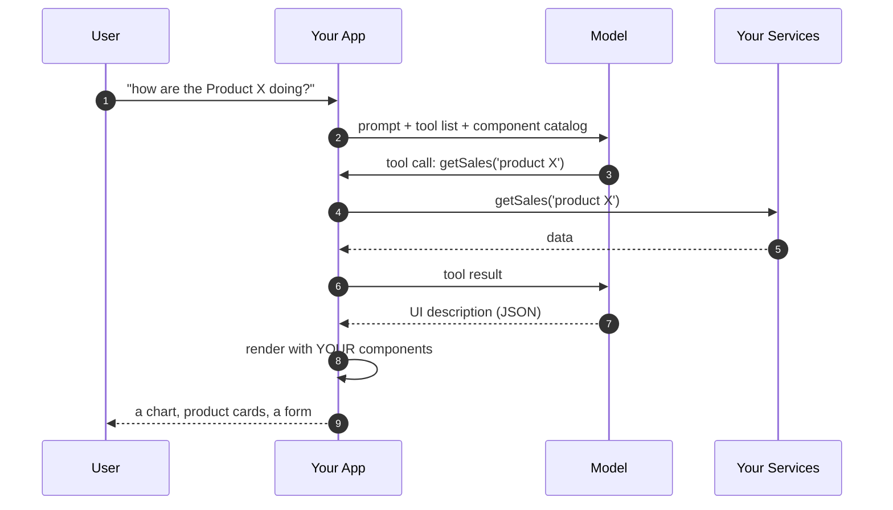
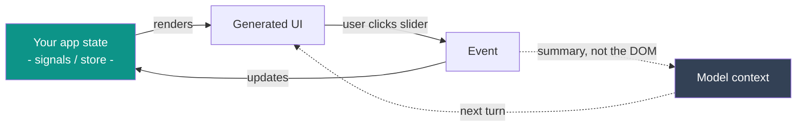

## One definition, and one anti-definition

> **Generative UI**: the model does not produce the interface. <br /> It produces a **description** of an interface, using components *you* wrote, and your app renders it.

<blockquote class="fragment"><b>It is <i>not</i>:</b> an LLM emitting raw HTML/CSS/JS that you <code>innerHTML</code> into the page.<br>That is a security incident with a nice demo.</blockquote>

<p class="fragment" style="text-align: center;"><b>The model picks from a menu. It does not cook.</b></p>

Note: "the model picks from a menu, it does not cook" — this is the line I want people to repeat at the coffee break. Everything else in the talk is a consequence of it.

---

## Three things an LLM can do for you

Prompt: *"who was Ada Lovelace?"*

**1. Generate text**: Useful, **unstructured**, **unrenderable**.

```txt
"Ada Lovelace was a 19th-century mathematician who wrote what is now considered the first algorithm..."
```

**2. Generate structured output**: You hand it a **schema**, you get back JSON that fits it. Every time.

```json
{ "name": "Ada Lovelace", "role": "Mathematician", "skills": ["Analytical Engine", "Algorithms", "Symbolic logic"] }
```

**3. Call your functions**: "tools". You describe what your app can do; the model decides *when* to call it. 

```ts
tools: [ getSales, findPerson, createTicket ]
```

<blockquote class="fragment">Generative UI = <b>#2 and #3</b>, pointed at your component library instead of your database.</blockquote>

Note: 60-second primer, because everything after this builds on it. Do not rush this slide — if they miss "structured output", nothing later makes sense. The analogy that works: structured output is a TypeScript interface the model is forced to satisfy.

Read the three blocks as one story, not three features: same question, three shapes of answer. The first is a paragraph — everything is in there and none of it is reachable; to put the role in a `<h3>` you would have to parse English. The second is the same knowledge with the structure kept, and the only thing that changed is that you supplied a schema.

Then the reveal, which pays off five slides later: **that JSON is not an example I invented.** Those three fields are literally the props of the `UserCard` component we are about to look at — `{ name, role, skills }`. Structured output is already generative UI as soon as the schema you hand the model happens to be the props of one of your components. That is the whole trick, and the rest of this section is just about who picks *which* component.

On block 3, say that these are ordinary application functions — `fetchSales` is the one behind the sales demo later. Nothing about them is AI-specific; the model only decides when they should run.

---

## The mechanism, in one picture



The model never touches the DOM, the network, or your state.

Note: walk it slowly, arrow by arrow. The two things to point at: step 2 (we send a *catalog*, not a design) and step 7 (JSON, not markup).

---

## Start from the components you already have


```tsx
<UserCard name="Valentino Rossi" role="Rider" skills={['MotoGP', 'GT racing', 'VR46']} />
```

```tsx
// A simple card with "name", "role" and a "skills" list
export type UserCardProps = { name: string; role: string; skills: string[] };

export function UserCard({ name, role, skills }: UserCardProps) {
  return (
    <div className="card">
      <h3>{name}</h3>
      <p>{role}</p>
      <ul>
        {skills.map((s) => <li key={s}>{s}</li>)}
      </ul>
    </div>
  );
}
```

No AI import, no base class, no decorator. 

A component you wrote months ago, styled and tested before any model existed.

Note: start here on purpose — the room needs to see that nothing about this component is special before I claim a model can assemble it. No decorator, no base class, no `data` envelope: it is the same `UserCard` that is already in your design system, and it was written, reviewed and tested long before any of this.

`UserCard` is deliberately the easy case: props in, pixels out. Whatever is in `name` is what appears in the `<h3>`.

End on the call site, because it is the hinge of the whole section: today *you* type that line, at build time, for a page you designed in advance. Nothing about the component is going to change in the next slide — the only thing that changes is **who writes that line, and when**. Hold that thought — two slides from now there is a component that does not work like this, and the difference is the whole point of the section.

---

## One tool for every component

```ts [1|3|4|5-13]
const tools: FunctionDeclaration[] = [
  {
    name: 'UserCard',
    description: 'Introduce a person: name, role and a few skills',
    parameters: {
      type: Type.OBJECT,
      properties: {
        name: { type: Type.STRING },
        role: { type: Type.STRING },
        skills: { type: Type.ARRAY, items: { type: Type.STRING } },
      },
      required: ['name', 'role', 'skills'],
    },
  },
  // …one entry per component in the catalog
];
```

> The `description` is the only manual the model gets: <br />
the schema can enforce that `name` and `role` are string, `skills` is an array of string and so on...


<blockquote class="fragment">The <code>parameters</code> schema is simply <code>UserCardProps</code> (see previous slide).</blockquote>


Note: walk the three steps of the highlight: the name is the one the model will call back, the description is how it decides, the schema is what it is allowed to send. Nothing here is framework magic — it is a plain object literal that happens to be shipped to a model.

The fragment is the reason `UserCard` came first: schema and props are the same three fields, so the declaration reads like the TypeScript type written twice. Every generative-UI tutorial you will find stops here. Say that out loud, then turn the page — because the interesting component is the one that does *not* work like this.


---

## What comes back

Prompt: _Who was Ada Lovelace?_

Result: 

```json
[
  { 
    "name": "UserCard",
    "props": {
       "name": "Ada Lovelace", 
       "role": "Mathematician",
       "skills": ["Analytical Engine", "Algorithms", "Symbolic logic"] 
    } 
  }
]
```


---

## Another component... that fetches data

```tsx
<SalesReport year={2025} category="shoes" />
```

```tsx 
export type SalesReportProps = { year: number; category?: string };

export async function SalesReport({ year, category = 'all' }: SalesReportProps) {
  const data = await fetchSales(year, category); // your DB, on the server

  return (
    <div>
      ... render data ...
    </div>
  );
}
```


Note: this is the component the room will remember, so slow down. `UserCard` was handed everything it renders; this one is handed two values and goes to get the rest.

Point at the `await` on the highlighted line and say it out loud: an ordinary **async server component**, the kind you already write in Next.js. No `useEffect`, no loading state, no client fetch — the data is loaded where the component is rendered, with your session and your row-level security, and only HTML crosses to the browser. `fetchSales` is a fake `SELECT` in the demo, but in your app it is the same service your existing dashboard already calls. (Honesty note if someone asks: the demo running later is a plain Vite SPA, so there the same component does the fetch in a `useEffect` — same idea, more ceremony.)

The reason this matters is not architecture, it is trust. The model has no idea what we sold in 2024 and must never pretend to. Say it plainly, then show its tool: **the model is choosing the query, not answering it.**

---

## A tool that describes the question, not the data

```ts [1-2|4|5-10|11-18]
const tools: FunctionDeclaration[] = [
  // ... other tools
  {
    name: 'SalesReport',
    description: `
      Total sales / revenue for one calendar year, broken down by month. Use it whenever 
      the user asks about sales, revenue or turnover of a given year. Send ONLY the year 
      (and the category, if the user named one): the component queries the database 
      itself. Never put sales figures in a BarChart — you do not have them.
    `,
    parameters: {
      type: Type.OBJECT,
      properties: {
        year: { type: Type.NUMBER, description: 'The calendar year, e.g. 2024' },
        category: { type: Type.STRING, enum: ['all', 'shoes', 'clothing', 'accessories'] },
      },
      required: ['year'],
    },
  }
```


Note: this is the second half of the previous slide, so open by pointing at the shape: same three fields, same array, and yet the schema has *shrunk*. `UserCard` declared everything it renders; this one declares two values and produces a whole report.

The size of a tool's schema is not the size of its UI — and that is a decision you make when you write it, not something the model gets to choose. Say the sentence that sums up the whole section: **the model is picking the query, not answering it.**

Then set up the next slide: everything that makes this tool safe is in the four lines of English above the schema, not in the schema.


---

## What comes back


Prompt: _How much did we sell shoes in 2024?_

Result:
```json
[
  { 
    "name": "SalesReport",
    "props": { 
      "year": 2024,
      "category": "shoes"
    } 
  }
]
```
The model chose the component to use, passing the parameters: `year` and `category`:<br />
the component can now fetch data using these params

---

## Three fields

Three things travel to the model: the **name**, the **description**, the **schema of the props**.

```ts [2|3|4-8]
{
  name: 'ToolName',       // WHICH component: the model sends this name back
  description: '....',    // WHEN to reach for it: prose, and the field that decides
  parameters: {           // WHAT it may send you: and nothing outside this
    type: Type.OBJECT,
    properties: { ... },
    required: [],
  },
}
```


<blockquote class="fragment">TIP: an <b>MCP tool</b> is declared with these same three fields: it just spells <code>parameters</code> as <code>inputSchema</code>.</blockquote>

Note: the same tool as the previous slide, cut down to the bone — three fields, one comment each. Read the three comments out loud in order and the whole mechanism is on screen at once; this is the slide to photograph.

The `description` field is the highest-leverage text in the entire system. Vague description, wrong component. I have wasted whole afternoons on this.

That last sentence is there because of a real failure, and it is worth confessing on stage. The catalog also contains a generic `BarChart` that takes `{ label, value }[]`. Without that line the model answers "how much did we sell in 2024?" by calling `BarChart` with twelve plausible, confident, entirely invented numbers. It looks perfect. It is fiction. One sentence of prose moved it to the tool that actually knows.

Point at the split: `enum` and `required` are what the SDK can check — if the model sends `category: 'hats'` I never see the call. The sentences here are what only the model can honour, and no amount of JSON Schema will express them.

Then land the fragment and move on — do not explain MCP yet. It is only a hook: when `tools/list` shows up later, the room should recognise the shape instead of learning it.

---

## Configure tools (in Gemini SDK)

```ts [1,3,4|5|7-9|10|11-14|18-21]
const ai = new GoogleGenAI({ apiKey });

const res = await ai.models.generateContent({
  model: 'gemini-3.8-flash',
  contents: 'Introduce Ada Lovelace, and tell me how much we sold in 2024.', // User Prompt
  config: {
    systemInstruction:
      'You are a UI generator. Call the tools that best answer the request. ' +
      'Call more than one when the request needs more than one component.',
    tools: [{ functionDeclarations: tools }],
    toolConfig: {
      // ANY = the model MUST call a tool. It cannot answer with prose.
      functionCallingConfig: { mode: FunctionCallingConfigMode.ANY },
    },
  },
});

// one function call per tool 
const ui = (res.functionCalls ?? []).map(
  (call) => ({ component: call.name, props: call.args }) as UISpec,
);
```

The model does not return a UI. 

It returns **which of your functions (one or many) to call, and with what arguments**.

Note: two things to point at. `mode: ANY` is the whole trick — it forbids prose, so the answer is always a UI. And `res.functionCalls` is a *list*: this is the jump from "the model picks a component" (level 3) to "the model composes a screen" (level 4) and it costs exactly one line of code. Say that the SDK already validated the arguments against the schema before handing them to me — if the model invents a prop, I never see it.


---

## Client: render components from Catalog

```tsx
const UIKIT = { Alert, UserCard, BarChart, SalesReport };

ui.map((item, i) => {
  const Component = UIKIT[item.component];
  return Component ? <Component key={i} {...node.props} /> : null
});
```

Anything outside the registry simply does not exist. No markup, no `innerHTML`, no exploit.


Note: the renderer is nine lines and there is no framework in sight — that is the point, and it is worth saying that everything else in this talk is this same idea with more plumbing. The `registry` lookup is the security boundary: it is a whitelist by construction, not a filter someone has to remember to write.

The fragment is the payoff of the last four slides, so pause on it. Put the two entries side by side out loud: `UserCard` carries its whole payload — if the model gets Ada's role wrong, a wrong role is what renders. `SalesReport` carries `{ "year": 2024 }` and nothing else, so there is no figure in that JSON *to* get wrong. Same pipeline, same nine-line renderer, two very different blast radii — and choosing which one a component gets is a decision you make when you write its schema, not something the model decides for you.

The other thing to say, because someone always asks: `props` came back already validated against the schema. If the model had sent `year: "last year"` the SDK would have rejected the call before my code ever saw it.

---

<!-- demo: http://localhost:5174/tools -->

## Live: one prompt, a composed screen

> "introduce Ada Lovelace and chart her three main contributions by impact"

> "how much did we sell in 2024?"

Note: this is the code from the last four slides, running. Type the prompt, then switch to the **raw JSON** panel before the rendered one — the room has to see that what came back is a list of `{ component, props }` and nothing else. Two tool calls, two components, one screen. Second prompt worth doing live if there is time: *"the disk is almost full"* — one call, one component, same pipeline. If the key is not set, the app asks for it; it lives in `localStorage`, never in the repo.

**Il secondo prompt è quello che vale il biglietto.** `SalesReport` è l'unico componente del catalogo che *non* riceve i dati: riceve un anno e, al massimo, una categoria. I numeri se li va a prendere da solo, con una `fetchSales(year, category)` che finge di essere una query. Guarda il pannello JSON mentre lo dici: il modello ha restituito `{ "year": 2024 }` e nient'altro — il fatturato che vedi sul grafico non è mai passato dall'LLM, quindi non può essere allucinato e la stessa domanda restituisce sempre gli stessi numeri. È la differenza fra "il modello *scrive* la UI" e "il modello *sceglie* la UI e i suoi parametri". Nella `description` del tool c'è la frase che lo rende affidabile: *"send ONLY the year: the component queries the database itself"* — di nuovo, la prosa che fa da guardrail, come tre slide fa.

Se c'è tempo, il chip "compare 2023 and 2024 sales for shoes": due tool call, due componenti, due query separate. Stesso pipeline, zero righe di codice in più.

---

## Six levels of outputs

| level | the model returns | you render | **UI** determinism | generative UI? |
| --- | --- | --- | --- | --- |
| 0 | plain text | `<p>` | total: the shape, not the words | no |
| 1 | Markdown | a markdown component | total: the shape, not the words | no |
| 2 | structured data | a component *you* chose | high: fixed layout, schema-checked data | **yes**: wired by hand |
| 3 | **which** component + props | your catalog | high: finite, known set | **yes** |
| 4 | a **composition** of components | your catalog, nested | medium: layout emerges at runtime | **yes** |
| 5 | code, run in a sandbox | a JS runtime in the browser | none: unknown until it runs | yes: plus a sandbox |

> More **adaptivity** = less **predictable UI**.

<p class="fragment"><b>2, 3 and 4 are all generative UI.</b> At 2 the model already decides the content, you just wire the component by hand.</p>

Note: this table is my answer to "is X generative UI?" — usually yes, at some level. Also a gentle way to tell people they can start at level 2 tomorrow without a framework. Read the determinism column top to bottom — it is the same sentence as the line under the table. Say out loud *which* determinism it is, because someone will object: the column is about the **shape** on screen, not about the content. On content the first rows are actually the worst — level 0 is free prose, level 2 is JSON validated against your schema — so the two axes cross: from 0 to 2 the content gets *more* predictable, from 2 to 5 the layout gets less. At 3 the model picks the component but only from your catalog, with props validated by your schema, so the same question gives you the same screen — that is why it is still "high". At 4 the pieces are still yours, but the overall layout emerges at runtime and nobody designed it. At 5 you do not know in advance what will appear, and isolation is the only defence left. Everything we build today lives at 3–4.

**Livello 5 — cos'è.** Il modello non sceglie un componente dal catalogo: scrive **codice** (tipicamente un componente React/JS o HTML+JS autonomo) che viene eseguito nel browser dell'utente al momento. È il livello degli Artifacts di Claude, del Canvas di ChatGPT o di v0: nessuno ha predichiarato quel componente, non esiste nel repo, viene alla luce per quella singola domanda.

**Quando serve davvero.** Nel nostro esempio e-commerce il catalogo copre chart, lista prodotti e form. Ma se l'utente chiede *"fammi uno scatter plot margine/unità vendute del trimestre, evidenzia gli SKU sotto l'8% di margine"*, nessuno dei tre componenti lo sa fare. Al livello 3–4 il modello può solo scegliere il chart più vicino e sbagliare; al livello 5 scrive il componente su misura:

```jsx
export default function MarginReport({ data }) {
  const low = data.filter(d => d.margin < 0.08);
  return (
    <>
      <h2>Margin vs units — Q3</h2>
      <Scatter points={data} highlight={low} />
      <p>{low.length} SKUs below 8%</p>
    </>
  );
}
```

**Come funziona in pratica.** Il punto cruciale è che quel codice non lo esegui mai nella tua pagina. Il flusso è:

1. Nel system prompt vincoli il formato: un solo componente autonomo, import consentiti solo da una lista bianca, niente accesso di rete, niente `window.parent`.
2. Il modello streamma il sorgente come stringa.
3. Lo passi a un **iframe cross-origin** con `sandbox="allow-scripts"` — deliberatamente senza `allow-same-origin`, così l'iframe finisce in un origin opaco e non può leggere i tuoi cookie, il tuo `localStorage` né il tuo DOM. Una CSP con `connect-src 'none'` gli toglie anche la rete.
4. Dentro quell'iframe gira un transpiler (Babel standalone o esbuild-wasm) che compila il JSX ed esegue il risultato.
5. I dati entrano e gli eventi escono **solo** via `postMessage`.

Se questa architettura suona familiare è perché è esattamente il sandbox proxy che abbiamo già nel demo su `:3010`: iframe su origin diverso, comunicazione solo a messaggi. La differenza non è tecnica ma di **provenienza**: in MCP UI l'HTML lo ha scritto l'autore del server ed è predichiarato come resource `ui://` (quindi prefetchabile, cacheabile, revisionabile), mentre al livello 5 arriva dal modello, diverso a ogni chiamata. Stesso muro, minaccia diversa.

**Il prezzo**, che è poi il motivo per cui non ci vai se non ti serve: emettere un componente costa centinaia di token invece di dieci (latenza e costo per ogni render), devi spedire al browser un runtime e un transpiler, non puoi scrivere test di regressione su una UI che cambia ogni volta, e l'accessibilità torna a essere una lotteria perché nessun design system la garantisce più.

---

## Why not just let AI write the code?

- **design system**: generated CSS drifts from your brand within one prompt
- **accessibility**: you spent months on focus management; a generated `<div onclick>` throws it away
- **security**: arbitrary markup from a probabilistic system, rendered in your origin. No.
- **testability**: you cannot write a regression test for a UI that is different every time
- **latency & cost**: emitting a component name is ~10 tokens; emitting a component is ~800
- **compliance**: you cannot audit a screen that existed once, for one user

<blockquote class="fragment">Constraining the model is not a limitation of the technique. <b>It is the technique.</b></blockquote>

Note: this is the slide the skeptical senior dev in row 3 is waiting for. Do not skip it. The token-cost argument usually wins over the architecture argument, oddly enough.

Sulla riga **compliance**, l'esempio da raccontare a voce. In banca, assicurazioni, sanità — o anche solo nell'e-commerce europeo — ci sono schermate obbligatorie per legge: l'informativa sui rischi prima di confermare un investimento, il consenso informato, il diritto di recesso e il prezzo IVA inclusa prima del checkout, il banner GDPR. Un giorno l'auditor chiede: *"dimostrami che ogni cliente che ha premuto Conferma aveva davanti l'avviso di rischio, nella forma prevista"*.

Con un catalogo la risposta è banale: componente `RiskDisclosure`, versione 2.3.1, questo commit, revisionato da queste persone, coperto da questi test; i log dicono che è stato renderizzato con quei dati, e chiunque può rieseguirlo e vedere la stessa identica cosa.

Con la UI generata a runtime non hai niente da mostrare: quella schermata è esistita una volta sola, per un utente solo, non è in nessun repository, nessuno l'ha revisionata prima della produzione e non è riproducibile — rifai la stessa domanda ed esce un layout diverso. "L'ha generata l'AI" non è una prova di conformità, è l'ammissione che la prova non c'è. È lo stesso motivo per cui la spec MCP UI vuole risorse `ui://` predichiarate: prefetchabili, cacheabili e soprattutto **revisionabili**.

---

## Who owns the state?



- The **app** owns state.
- User interactions go through your normal handlers (no AI here).
- You feed the model a **summary** of what changed, so the next turn is coherent.

Note: common beginner mistake: treating the generated tree as state and re-asking the model on every interaction. Slow, expensive, non-deterministic. The model is a UI compiler, not an event bus.


---

## The hard parts (that demos never show)

- **non-determinism**: the same question can produce two different layouts. Users notice.
- **evaluation**: "is this UI good?" is not a unit test. You need human review.
- **fallbacks**: what renders when the model picks nothing? Always ship a prose fallback.
- **latency budget**: a tool call + a UI generation is seconds, not milliseconds. Design for it.
- **accessibility**: Your components carry the a11y contract.
- **i18n**: the model can answer in the wrong language. Pin it in the system prompt.
- **cost**: every render is tokens. Cache aggressively; not every screen deserves a model.

Note: ACCESSIBILITY

 generated ≠ exempt — "generata" non vuol dire "esentata". Nessuna normativa e nessun utente fa sconti perché la schermata l'ha composta un
  modello: WCAG, European Accessibility Act, screen reader, navigazione da tastiera valgono identici. E soprattutto non c'è nessuno a cui
  dare la colpa: davanti a un audit di accessibilità "l'ha decisa l'AI" non è una scusante, è la tua UI. È il rovescio del bullet di slide 24
  (riga 420): lì l'argomento era "se lasci scrivere il markup al modello butti via mesi di focus management", qui è "e comunque resti tu il
  responsabile".

  Your components carry the a11y contract — la parte rassicurante, ed è tutta la tesi del catalogo. Siccome il modello emette solo un nome
  più delle props, non tocca mai il DOM: ruoli ARIA, label, ordine di tabulazione, gestione del focus, contrasto, target di tocco vivono nei
  tuoi componenti, già scritti, già revisionati, già testati. L'accessibilità è compilata dentro la libreria una volta sola, non rinegoziata
  a ogni risposta. Un <div onclick> generato al volo non ha nessun contratto; il tuo <Button> sì.
--
CACHE: VARIE OTTIMIZZAZIONI
BASE:
 1. Non chiamare il modello — not every screen deserves a model
 Se l'input matcha un intent noto — un click su un suggerimento, una query salvata, un pattern riconoscibile — rendi il componente direttamente. 

2. GIUSTO MODELLO
Modello piccolo e veloce (Flash / Haiku) per scegliere il tool; quello grande solo se il piccolo non è sicuro o se la richiesta è composita. Scegliere fra 20 nomi non è un compito da modello di frontiera.

3.   Entry point non conversazionali. Bottoni, filtri, deep link: producono la stessa tool call a costo zero. Il modello è per chi non sa come
  chiedere.§§
ALTRE OTTIMIZZAIZONI:
1. Cachare la decisione, non la risposta
 Cache della tool call — chiave: hash(domanda normalizzata + versione catalogo + locale + ruolo utente), valore: il JSON minuscolo { name:
    'SalesReport', args: { year: 2024 } }. Cache hit = il modello non viene chiamato affatto.

2. pagare meno la chiamata che fai davvero

  Prompt / context caching del provider. Nel tuo payload la parte grossa e stabile è il system prompt più il catalogo dei tool — nome,  description e schema di ogni componente, e le description sono lunghe apposta. Tutti i provider hanno una forma di caching del  prefisso; su Gemini, che è quello dei demo, è il context caching. Due regole pratiche: il prefisso deve essere byte-identico fra una chiamata e l'altra, e tutto ciò che varia — timestamp, user id, cronologia — va dopo il catalogo, mai in mezzo. Sbagliare l'ordine dei messaggi è il modo più comune per pagare tutto a prezzo pieno senza accorgersene.

---

<!-- disabled -->

## Rules of thumb

| | |
| --- | --- |
| **start narrow** | one flow, five components, one clear job |
| **write descriptions like docs** | they are the model's only manual |
| **design for partial** | every component must render half-empty |
| **keep a prose fallback** | always. It is your 500 page |
| **never render untrusted markup** | catalog or sandbox. No third option |
| **generative ≠ everywhere** | static UI is still the right answer for most screens |

Note: last one matters most and it is the one people forget: this is a tool for the long tail of intent, not a replacement for your checkout page.

---

# UI can come from...  <span class="fragment">the Client or the Server</span>

---

## Two places the UI can come from:

| **CLIENT: inside your app** | **SERVER: from a remote server** |
| --- | --- |
| 1. the model _composes_ **your own** components | 1. a third party _ships the data_ **and** _its UI_, in a sandbox |
| 2. full design-system fidelity | 2. the server team owns its own UX |
| 3. you own your state, UI, your tests | 3. isolation, trust and consent become **protocol** problems |
| 4. you control everything | 4. interop: any host |
| GOAL: _"Pixel Perfect"... in your app_ 🥳 | GOAL: _Goog Enough, everywhere_ 😅 |

<p class="fragment">Same idea, two approaches. The second one is <b> MCP Apps</b>.</p>

Note: this is the hinge slide into the MCP UI / MCP Apps part. Do not name the libraries yet — name the two *problems* first, so the tools land as answers.


---

## Enough theory. What's next?

1. CLIENT: Use GenUI framework .
2. SERVER: **MCP Apps**.

