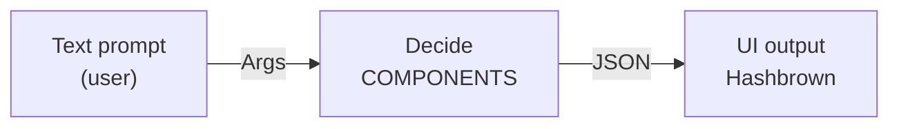
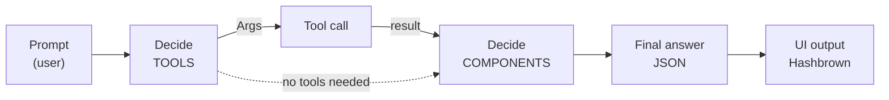

# Hashbrown

**Build agents that run in the browser** — [hashbrown.dev](https://hashbrown.dev)

<div class="mockup-frame">
  <iframe src="https://hashbrown.dev/" style="width: 100%; max-width: none; height: 360px;" allowfullscreen></iframe>
</div>

Note: this is the other half of the "two places the UI can come from" slide. MCP UI is the remote-server case: a third party ships data *and* interface. Hashbrown is the in-app case: the model composes components you already own, inside your own design system. Same idea, completely different trust boundary.

---

## What it is

- A **client-side** framework for Angular and React: the agent loop runs in the browser
- The model does not emit HTML: it picks from a **catalog of your components** and fills their inputs
- Provider-agnostic: OpenAI, Google, Anthropic, Writer, Ollama, Azure
- Streaming-first, signal-based on the Angular side
- Open source, MIT

Note: the important word is *catalog*. The model never returns markup. It returns a JSON tree that says "render `PropertiesList` with these properties". You keep your design system, your DI, your tests, your a11y contract. Nothing untrusted ever reaches the DOM.

---

## Demo: where we are going

<video src="assets/hashbrown/ChatDemo-RealEstate.mp4" controls muted playsinline preload="metadata" style="width: 78%; aspect-ratio: 1920 / 1080; display: block; margin: 0 auto;"></video>

Note: thirty seconds, then move on. One input, no filters — the model picks the list, the map and the booking form out of the catalog and fills them. Everything after this slide is how those three components got there. Say out loud that this runs entirely in the browser: no agent on the server.

---

## Angular mental model with Signals & `httpResource`

<div style="display: flex; gap: 2rem; align-items: flex-start;">
<div style="flex: 0.85; min-width: 0;">

**How you use it**

```html
<app-user [id]="userId()" />
```

<p style="font-size: 0.75em; opacity: 0.75;">One input goes in. Loading, error and data all live <b>inside</b> the component.</p>

</div>
<div style="flex: 1.4; min-width: 0; font-size: 0.9em;">

```ts [13-16|4-6|7-9|10]
@Component({
  selector: 'app-user',
  template: `
    @if (user.isLoading()) {
      <div>loading...</div>
    }
    @if (user.error()) {
      <div>Server error</div>
    }
    <div>{{ user.value()?.name }}</div>
  `,
})
export class User {
  id = input(); // get it from router
  user = httpResource<UserModel>(() => `/api/${this.id()}`);
}
```

</div>
</div>

Note: if the room knows Angular 20, this slide does all the work for me. A resource is a reactive async value with three signals: `isLoading`, `error`, `value`. Hashbrown's whole API is *that shape*, applied to a model instead of an endpoint. Nothing new to learn — same ergonomics, different backend.

---

## How it works — the simple case



The model receives the prompt **and** the component catalog. It answers with a JSON tree. Hashbrown renders that tree with your real components.

Note: three boxes only, on purpose. Prompt in, JSON out, components rendered. The model is a UI compiler — it decides *what* to show; your app still decides *how* it looks and how it behaves.

---

## The chat resource

```ts [2|3|4|5-9|10-14]
export class App {
  chat = uiChatResource({
    model: 'gemini-2.5-flash',
    debugName: 'chat',
    system: `Today is ${new Date().toDateString()}.
      You are a real estate assistant.
      You can help users find properties.
      ... instructions here ...
    `,
    components: [
      Component1Declaration,
      Component2Declaration,
      Component3Declaration,
    ],
  });
}
```

Note: one object, four keys that matter. `model` is a string — swapping provider is a config change, not a rewrite. `system` is the whole behaviour of the assistant. `components` is the catalog: this is the list the model is allowed to choose from, and nothing else.

---

## Sending a message

```ts
chat.sendMessage({
  role: 'user', 
  content: 'Are there available properties in Roma?'
})
```

Note: that is the entire write API. Bind it to your input's submit handler and you are done — no store, no effects, no manual streaming plumbing.

---

## Rendering the conversation

```html [1-2|4-13|10]
@if (chat.isLoading()) { <app-loader /> }
@if (chat.error())     { <app-error-alert /> }

@for (message of chat.value(); track $index) {
  @switch (message.role) {
    @case ('user') {
      <p>{{ message.content }}</p>
    }
    @case ('assistant') {
      <hb-render-message [message]="message" />
    }
  }
}
```

Note: `isLoading` and `error` again — same resource shape as the first slide. The one new thing is `hb-render-message`: it takes the assistant message and mounts the component tree the model chose. That single line is where generative UI actually happens.

---

## Exposing components

```ts [10-14]
export class App {
  chat = uiChatResource({
    model: 'gemini-2.5-flash',
    debugName: 'chat',
    system: `Today is ${new Date().toDateString()}.
      You are a real estate assistant.
      You can help users find properties.
      ... instructions here ...
    `,
    components: [
      uiSimpleMessageComponent,
      uiGoogleMapComponent,
      uiBookVisitAndAppointment,
    ],
  });
}
```

The catalog is **explicit**. A component the model cannot see, it cannot render.

Note: this is the security story in one line. There is no "render anything" escape hatch. Adding a component to a chat is a deliberate act, per chat — you can ship a narrow catalog for the support widget and a wider one for the internal tool.

---

## `exposeComponent` #1: a plain component

<div style="font-size: 0.8em; opacity: 0.75; margin: 0 0 0.4em;">An ordinary Angular component: nothing AI about it</div>

```ts [1-9]
@Component({
  selector: 'app-simple-message',
  template: `
    <div> {{ text() }} </div>
  `,
})
export class SimpleMessage {
  text = input.required<string>();
}
```

<div style="font-size: 0.8em; opacity: 0.75; margin: 0 0 0.4em;">The description the model reads</div>

```ts [1-11|6|8]
export const uiSimpleMessageComponent = exposeComponent(
  SimpleMessage,
  {
    description: `Display a simple text response to the user`,
    input: {
      text: s.string('The msg to display'),
      // or 
      text: s.streaming.string('The msg to display'),
    },
  },
);
```

Note: on top, an ordinary Angular component — nothing AI about it, it existed before. Below, the description the model reads. `description` is the manual; `input` maps one-to-one onto the component's signal inputs. `s.streaming.string` means the text renders token by token as it arrives instead of popping in at the end.

---

## `exposeComponent` #2: A Map component

```ts [5-8]
export const uiLeafletComponent = exposeComponent(
  LeafletComponent,
  {
    description: 'Display a map centered on the given coordinates',
    input: {
      coords: s.array('The coordinates of the map center', s.number('Latitude and Longitude')),
      zoom: s.number('The zoom level of the map'),
    },
  },
);
```

Every field carries a **description** — that string is the only documentation the model gets.

Note: this is the part people underestimate. The schema is not validation, it is the prompt. "The zoom level of the map" is what makes the model pick 13 for a street and 6 for a region. Write these like docs, not like types.

---
## `exposeComponent` #3: Nested schemas

<div style="display: flex; gap: 1.5rem; align-items: flex-start; font-size: 0.8em;">
<div style="flex: 1; min-width: 0;">

```ts [13-15|4-11|7-9]
@Component({
  selector: 'app-properties-list',
  template: `
    <div>
      @for (p of properties(); track p.id) {
        <div> {{ p.address }} </div>
      } @empty {
        <p>No properties found.</p>
      }
    </div>
  `,
})
export class PropertiesList {
  properties = input<Property[]>([]);
}
```

</div>
<div style="flex: 1.1; min-width: 0;">

```ts [3|5-18|13-16]
export const uiPropertiesListComponent = exposeComponent(
  PropertiesList, {
    description: 'Display a list of real estate properties',
    input: {
      properties: s.array(
        'A list of properties',
        s.object('Property', {
          id: s.number('Property id'),
          address: s.string('Street address'),
          city: s.string('City'),
          type: s.string('Property type'),
          price: s.number('Price in EUR'),
          location: s.object('Location', {
            lat: s.number('Latitude'),
            lng: s.number('Longitude'),
          }),
        }),
      ),
    },
  },
);
```

</div>
</div>

Note: note the `@empty` block. Every exposed component must render half-empty and render zero-results — the model *will* hand you an empty array, and it will hand you a partial object mid-stream. Design for partial is not optional here.

---

## Streaming changes the UX more than you expect

<div class="cols">
<div class="col">


```ts 
text: s.string('The description of the product'),
```

</div>

<div class="col">


```ts 
text: s.streaming.string('The description of the product'),
```

</div>
</div>


<div style="display: flex; gap: 2.5rem;">
  <div style="flex: 1;">
    <p><strong>Without streaming</strong></p>
    <pre style="padding: 0.8em 1em;">[ spinner ]
[ spinner ]
[ spinner ]
→ 4.2s → everything appears</pre>
    <p style="font-size: 0.7em; opacity: 0.7;">Feels broken.</p>
  </div>
  <div style="flex: 1;">
    <p><strong>With streaming</strong></p>
    <pre style="padding: 0.8em 1em;">0.3s → first card, name only
0.6s → slider, still empty
1.1s → second card
...  → progressively complete</pre>
    <p style="font-size: 0.7em; opacity: 0.7;">Feels alive.</p>
  </div>
</div>

<p class="fragment">The tree arrives <b>partial</b>. <br /> Your components must survive being rendered with half their inputs:<br /> skeletons, optional props, no crashes on <code>undefined</code>.</p>

<p class="fragment">That is what <code>s.streaming.string</code> and the <code>@empty</code> block on the previous slide are for.</p>

Note: concrete war story here: the first version I built waited for the full JSON. Same model, same latency, and it felt twice as slow. Streaming is not an optimization, it is the product.

---

## Tools: letting the model fetch

```ts [2|3|4-7|8-12]
export const fetchPropertiesTool = createTool({
  name: 'fetchProperties',
  description: 'Fetch real estate properties, optionally filtered by city',
  schema: s.object('Args', {
    city: s.string(`All the properties filtered by city (e.g. Roma, Milano).
                    Use empty string for all cities.`),
  }),
  handler: async ({ city }) => {
    const url = `/buildings?city=${city}`;
    const res = await fetch(url);
    return await res.json();
  },
});
```

The handler runs **in the browser** — your session, your interceptors, your auth.

Note: this is the difference from a server-side agent. The tool is a normal client function: it can hit your API with the user's cookie, read a signal, open a dialog, navigate the router. No credential ever leaves the browser, and the model never sees the endpoint.

---

## Tools + components together

```ts [10|11-16]
export class App {
  chat = uiChatResource({
    model: 'model', // 'gemini-2.5-flash',
    debugName: 'chat',
    system: `Today is ${new Date().toDateString()}.
      You are a real estate assistant.
      You can help users find properties.
      ... Instructions and Rules here ...
    `,
    tools: [fetchPropertiesTool],
    components: [
      uiSimpleMessageComponent,
      uiPropertiesListComponent,
      uiGoogleMapComponent,
      uiBookVisitAndAppointment,
    ],
  });
}
```

Note: one tool, four components. The tool brings the data in; the components decide how it comes out. Point at the pairing on the slide: `fetchProperties` returns the array that `uiPropertiesListComponent` was described to accept — that is not a coincidence, it is the design.

---

## How it works — the full loop



Note: same picture as before with the tool loop inserted. Two things to say out loud: the tool branch is optional — for "hello" the model skips straight to components; and the loop can run more than once. Which is also where your latency budget goes.

---

## Demo: Simple Chat

<video src="assets/hashbrown/ChatDemo-RealEstate.mp4" controls muted playsinline preload="metadata" style="width: 78%; aspect-ratio: 1920 / 1080; display: block; margin: 0 auto;"></video>

Note: plain chat shell, no widgets of its own. Everything that appears below the prompt is chosen by the model from the catalog.

---

## Demo: real estate agent


Note: one input, no filters, no facets. "Show me the properties in Milan under 400k with a garden" — that sentence would be six form controls in a classic UI, and nobody would use five of them.

---

## Client configuration

```ts [4-7|5|6]
export const appConfig: ApplicationConfig = {
  providers: [
    // ...
    provideHashbrown({
      baseUrl: '/api/chat',
      emulateStructuredOutput: true,
    }),
  ],
};
```

`baseUrl` points at **your** backend — the API key never reaches the browser.

Note: `emulateStructuredOutput` is the compatibility switch: models without native structured output get the schema enforced by Hashbrown instead. Turn it on when you are not sure what is behind the proxy.

---

## The server side

```ts [1|7|8-11|13|15-17]
import { HashbrownGoogle } from '@hashbrownai/google';
import express from 'express';

const app = express();
app.use(express.json());

app.post('/chat', async (req, res) => {
  const stream = HashbrownGoogle.stream.text({
    apiKey: process.env.GOOGLE_API_KEY!,
    request: req.body,
  });

  res.header('Content-Type', 'application/octet-stream');

  for await (const chunk of stream) {
    res.write(chunk); // Pipe each encoded frame as it arrives
  }

  res.end();
});

app.listen(3000);
```

Twenty lines. The backend is a **pipe**, not an agent.

Note: this is the whole server. All the intelligence — catalog, schemas, tools, system prompt — lives in the client. Swap `HashbrownGoogle` for `HashbrownOpenAI` and nothing else in the app changes. And because it is just a proxy, this is also where you put rate limiting, quotas and audit logging.

---

# Natural Language FORMS

The same primitives, without a chat.

Note: gear change. Everything so far was conversational. But `uiChatResource` is one of several resources — the interesting one for boring enterprise apps is the structured completion.

---

## Demo: one paragraph → a filled form

<video src="assets/hashbrown/Form-Natural-Language.mp4" controls muted playsinline preload="metadata" style="width: 78%; aspect-ratio: 1920 / 1080; display: block; margin: 0 auto;"></video>

Note: paste — or dictate — a messy sentence on the left, get typed fields on the right. This is the demo that sells the idea to people who do not care about chatbots: nobody enjoys filling a seven-field form, and everybody can describe what they want in one sentence.

---

## The schema is the form

```ts [1|2-3|8]
const CONTACT_FORM_SCHEMA = s.object('Structured contact form data', {
  firstName: s.string('First name of the person'),
  lastName: s.string('Last name of the person'),
  email: s.string('Email address'),
  phone: s.string('Phone number'),
  subject: s.string('Subject or reason for contact'),
  message: s.string('The full message or request'),
  priority: s.enumeration('Priority level', ['low', 'medium', 'high']),
});
```

Note: `s.enumeration` is the one to point at — the model cannot answer "urgent-ish". The schema is a contract, and the descriptions are what make the mapping accurate.

---

## `structuredCompletionResource`

```ts [1|2|3|4-10|11|14]
completion = structuredCompletionResource({
  model: 'gemini-2.5-flash',
  input: this.submittedText,
  system: `
    You are a form parser.
    Extract structured contact form data from the user's natural language message.
    * The user can speak in any language. Detect and handle it.
    * Keep the message as a clean summary of the user's request.
    * If a field is not mentioned, use an empty string.
  `,
  schema: CONTACT_FORM_SCHEMA,
});

formData = computed<ContactForm | null>(() => this.completion.value() ?? null);
```

Note: `input` is a **signal** — when `submittedText` changes the completion re-runs on its own. That is the whole reactivity story: no subscribe, no effect, no manual trigger. And read the three system rules out loud, they are the difference between a demo and something that survives real users.

---

## Binding it back to the DOM

```html
<input type="text" [value]="formData()?.firstName">

<textarea [value]="formData()?.message"></textarea>
```

No AI in the template. Just a signal holding a typed object.

Note: this is the punchline of the whole section. The generated part stops at the boundary; from here down it is an ordinary Angular form with ordinary validation. That is what "intelligence where it helps, nowhere it doesn't" means in practice.

---

## Demo: all of it together

<video src="assets/hashbrown/ChatDemo-RealEstate.mp4" controls muted playsinline preload="metadata" style="width: 78%; aspect-ratio: 1920 / 1080; display: block; margin: 0 auto;"></video>

Note: same clip, now that every piece has a name. Point at them as they appear: `fetchProperties` is the tool call, the list is `uiPropertiesListComponent`, the map is `uiGoogleMapComponent`, the booking form is `uiBookVisitAndAppointment`. Nothing on screen is generated markup — it is all components that existed before the chat did.

---

## Where Hashbrown fits

| | |
| --- | --- |
| **runs** | in the browser, in your app |
| **renders** | your components, from an explicit catalog |
| **tools** | client-side functions, with the user's session |
| **server** | a streaming proxy, ~20 lines |
| **trust boundary** | none crossed — it is all your code |


> Hashbrown is the answer _when you own every component on screen_. <br />
The moment the UI comes from someone else's server, you need isolation and consent as a protocol. <br/>
And that is exactly what the rest of the talk is about.
