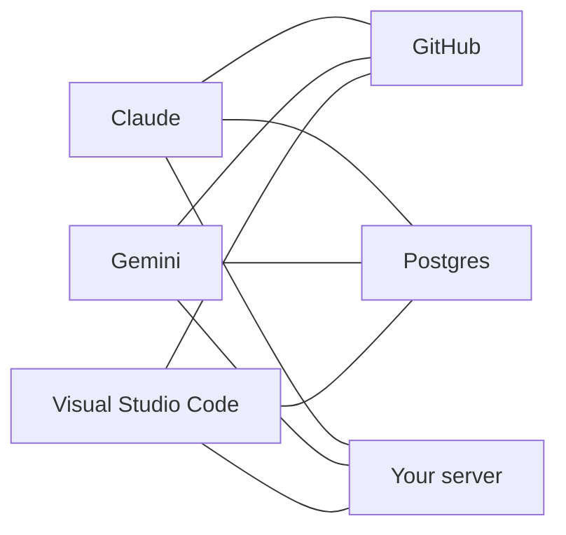
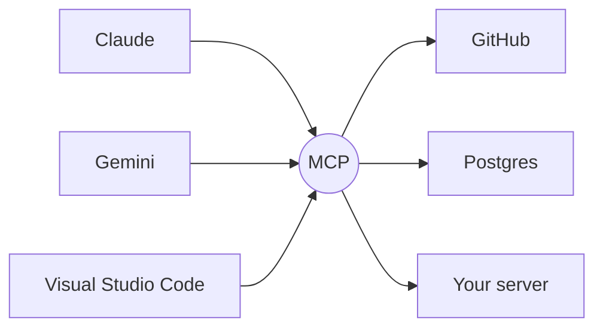
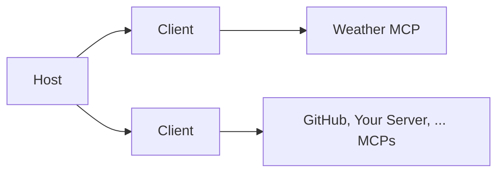

# MCP Apps
## Load widgets in Angular, React, Vanilla JS, ...
### ... and  in Claude Desktop, ChatGPT, VSC or any other client that supports MCP Apps

---

# MCP

**Model Context Protocol**: the open standard that lets any AI app use *your* tools and *your* data.

Note: five minutes, just enough to have the same words. Whoever already writes MCP servers can look at their phone.

---

## The problem before the protocol

A model on its own can only produce text. To do anything useful it needs your data, your APIs, your files.



Every host × every service = **a custom integration each time**.

Note: the classic M×N. Each vendor invented its own plugin format, and the same GitHub connector had to be rewritten three times.

---

## The answer: one protocol in the middle



Every host that speaks MCP can use it.

- open standard, introduced by Anthropic at the end of 2024
- SDKs in TypeScript, Python, Java, C#, …
- "the USB-C of AI applications" — the analogy is theirs, and it holds

---

## Who is who

| | |
| --- | --- |
| **Host** | the app with the chat: Claude Desktop, an IDE, *your* React app |
| **Client** | the piece inside the host that keeps one connection open, one per server |
| **Server** | what you write: exposes capabilities over a transport |



Note: the distinction that matters for later — **the model never talks to the server**. The host does. The model only decides *what* to ask for, and it is the host that executes, or refuses.

---

## What a server exposes

| PRIMITIVE | EXAMPLE | WHO DECIDES TO USE IT |
| --- | --- | --- |
| **Tools** | `get_weather`, `fetch_data`, ... | the **model** (i.e. Gemini) |
| **Resources** | a file, a record, `ui://…` | the **host** (i.e. the Client) |
| **Prompts** | a slash command, a template | the **user**, explicitly |

> Keep **resources** in mind, they come back soon with MCP Apps / MCP UI

Note: three primitives, three different owners. The confusion "resource = anything read-only" comes precisely from ignoring who pulls the trigger. On the middle row, say it out loud: a resource is fetched by the **host application** — either because the user picked it (attaching a file, an @-mention) or because the app's own logic went and got it. The model can never reach for one by itself. That second case is the one that matters today: the `ui://` widget is fetched by the host on its own, because the tool result points at it. Nobody clicks anything.

---

## Register a Tool

```ts [1-3|5-6|7-11]
server.registerTool("get_weather", {
  description: "Current weather for a city",
  inputSchema: { city: z.string().describe("City name, e.g. 'Roma'") },
},
  async ({ city }) => {
    // fetch data here: await fetch(...)
    return {
      content: [
        { type: "text", text: "Rome: 23°, clear sky" },
      ],
    };
  },
);
```

- the **description** and the `describe()` strings are the prompt: that is what the model reads to decide
- the return value is `content`

Note: no parsing, no intent matching, no routing. You declare the shape, the model fills it in. Which is also why a badly written description is a bug.

---

## Transport

How the host and the server talk. Two options:

| | |
| --- | --- |
| **stdio** | the server runs on your machine, as a process |
| **HTTP** | the server lives at a URL |

Today: **HTTP**, on `localhost:3010`.

Note: stdio is the local case — zero config, it is what Claude Desktop does. HTTP is the one that matters here: our host is a browser app, and a widget in an iframe needs an origin. A process has none.

---

## So then

The server says what it can do. The model chooses. The host executes and gets back…
