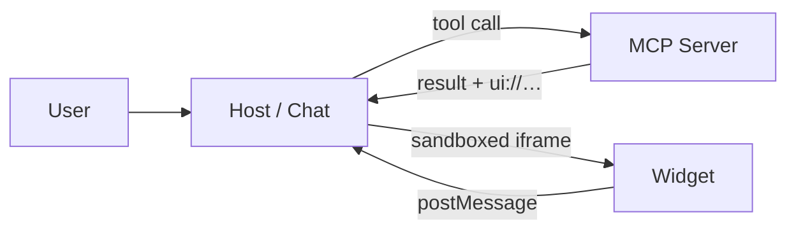

# MCP UI & MCP Apps

When a tool answers with an **interface** instead of text.

*Short Introduction*

Note: SHORT VERSION

this is the condensed run of the MCP UI section. Everything here comes back in far more detail in the long version — if the slot is generous, skip this and go straight to it. Say the title out loud once: "MCP UI" is both the generic idea and the name of a library, and the next slides untangle the two.

---

## A tool can only answer with text

<div class="cols">
<div class="col">

**Today**

```json
{
  "content": [
    {
      "type": "text",
      "text": "5 properties match..."
    }
  ]
}
```

> _useless_ to populate components: lists, maps or grids

</div>
<div class="col">

**What we want**

```ts
{
  content: [{
    type: "text",
    text: `5 properties match...`,
  }],
  structuredContent: {
    items: [{ ... }, { ... }, ...],
    total: 5,
  },
}
```

> _data for the UI_, prose for the model

</div>
</div>

Note: this is not about looks. A conversation is an extremely narrow interface: every interaction costs a full round trip through the model. Two channels leave together — `content` is written for the model, `structuredContent` for the widget.

---

## The idea

Along with the result, the tool declares **a UI to render**.



The host knows nothing about the widget: it downloads it from the server and runs it **isolated**.

Note: the whole talk is this diagram. The server ships data *and* interface; the host renders something it has never seen, in a sandbox, and the only channel back is `postMessage`.

---


---

<!-- demo: http://localhost:5173/#/ -->

## MCP Demo

> "immobili a Roma sotto i 500.000 euro"

---

## Two names, one mechanism

| | **MCP Apps** | **mcp-ui** |
| --- | --- | --- |
| what it is | the official **spec** | an **implementation**, plus DX |
| it defines | `ui://`, mimeType, `_meta.ui`, the postMessage protocol | `createUIResource`, `AppRenderer`, the sandbox proxy |

They are not alternatives: **mcp-ui speaks MCP Apps**.

| | |
| --- | --- |
| **Server** | exposes the tool **and** the UI resource |
| **Host** | calls the tool and mounts the widget |
| **Widget** | HTML/JS inside a sandboxed iframe |

Note: spec vs library, like the DOM and jQuery — if mcp-ui disappeared you would rewrite code, not the contract. And the naming trap: "MCP UI" is both the generic idea (what the talk title means) and the `mcp-ui` project (what the `package.json` means).

---

# MCP UI: Server

---

## The server: three steps, one file

```ts [1-2|4-8|10-12|14-22]
const htmlPath = path.join(__dirname, "hello-widget.html");  // a plain .html file
const htmlString = fs.readFileSync(htmlPath, "utf8");

const helloUI = createUIResource({            // 1. create
  uri: "ui://fb-server/hello-widget",         //    an address, made up but unique
  encoding: "text",
  content: { type: "rawHtml", htmlString },   //    or externalUrl: an iframe URL
});

registerAppResource(server, "hello_world_ui", helloUI.resource.uri, {},
  async () => ({ contents: [helloUI.resource] }),   // 2. publish it for resources/read
);

registerAppTool(server, "hello_world", {      // 3. bind + answer
  inputSchema: { name: z.string().optional() },
  _meta: { ui: { resourceUri: helloUI.resource.uri } },   // ← the same address
},
  async ({ name }) => ({
    content: [{ type: "text", text: `Hello ${name}.` }],   // ← for the model
    structuredContent: { name: name || "world" },          // ← for the widget
  }),
);
```

**Only the URI binds** — and it has to match, character for character, in both places.

Note: three steps, three MCP primitives, nothing invented.

 **1. Create** — wrap the HTML in a UI resource and give it an address: `ui://` is enforced, the rest is a made-up unique string. 

**2. Publish** — register that resource on the server so the host can fetch the HTML with `resources/read`. This is the one people forget: without it the tool answers fine but the widget never appears.

 **3. Bind + answer** — register the tool, point `_meta.ui.resourceUri` at the same address so the host knows which widget to mount, and return two channels: `content` for the model, `structuredContent` for the widget. A host that ignores `_meta` still gets the text — you are adding a layer, not breaking compatibility.

---

## The widget: an ordinary HTML file

No build, no framework, no bundler.

```html [1|4-5|7|10-11|14]
<div class="hw-title" id="hw-title">Hello, world!</div>

<script type="module">
  // the App class, served by the MCP server itself
  import { App } from "http://localhost:3010/ext-apps.js";

  const app = new App({ name: "hello-widget", version: "1.0.0" });

  // the model's arguments first, then the server's structuredContent
  app.addEventListener("toolinput", (i) => setTitle(i?.arguments?.name));
  app.addEventListener("toolresult", (r) => setTitle(r?.structuredContent?.name));

  // listeners BEFORE connect() — from here on the host pushes the data
  await app.connect();
</script>
```

The only dependency is `App`, served over HTTP by our own MCP server: six lines of Express, **no CDN, no build step**.

> `connect()` is the widget telling the host **"I'm ready"**

Note: on the import:

1. `import { App } from "@modelcontextprotocol/ext-apps"` cannot work here — this HTML runs inside a sandboxed iframe, there is no bundler and no `node_modules` to resolve the name against, only a URL resolves. 

2. A CDN would resolve it, but the widget would then depend on a third-party host: 

 So the MCP server serves the package's own `app-with-deps` bundle at `/ext-apps.js`, a few lines of Express: the same file that sits in `node_modules`, pinned by our lockfile, and the widget never leaves our machine.

The handshake is the part to insist on: the host mounts the iframe but sends nothing until the widget says it is ready (`ui/initialize` over postMessage) — only then do `ui/notifications/tool-input` and `tool-result` start flowing. It is not a race you can win by luck: register first, connect after. Then the two events, in order: `toolinput` fires while the tool is still running — a spinner with the right city name already in it; `toolresult` fires second and wins.

---

# MCP UI: Client 
## Your App in Angular, React, Vanilla JS, ...
## or Claude Desktop, ChatGPT or any other client that supports MCP Apps

---

## First: what is `client`?

The **host** is our React app. The `client` is one object inside it: **one connection to one server**.

```ts [1|3-6|8-10]
import { UI_EXTENSION_CAPABILITIES } from "@mcp-ui/client";

const client = new Client(
  { name: "my-mcp-client", version: "1.0.0" },
  { capabilities: { extensions: UI_EXTENSION_CAPABILITIES } },  // ← "I can render ui://"
);

const transport = new StreamableHTTPClientTransport(new URL("http://localhost:3010/mcp"));

await client.connect(transport);   // from here on: listTools, callTool, readResource
```

Three lines. From now on `client` is what both the model *and* `AppRenderer` are handed.

Note: the words collide, so say it out loud — **host** is the app (it owns the conversation, decides, renders), **client** is its connection, one per server. Everything on the next slides takes this same object: `mcpToTool(client)` publishes its tools to Gemini, `client.callTool()` executes them, and `<AppRenderer client={client}>` uses it to do the `resources/read` that fetches the widget. `UI_EXTENSION_CAPABILITIES` is the handshake bit that declares "this host can render `ui://` resources": without it a well-behaved server has no reason to send you a widget.

---

## Use the MCP with Gemini

The host: the model decides with tool it should use


```ts [1|3-4|6]
const ai = new GoogleGenAI({ apiKey });

const chat = ai.chats.create({
  model: "gemini-3.8-flash",
  config: {
    tools: [mcpToTool(client), /* other tools */, ...],
  },
});
```


---

## The loop, by hand

```ts [1-2|4-6|8|10-11|13-16]
let result = await chat.sendMessage({ message: userText });
let functionCall = getFunctionCall(result);

while (functionCall) {
  // ① all we know is what the model asked for: widget on screen, empty, spinner
  setToolData({ callId, name, input: args });

  const toolResult = await client.callTool({ name, arguments: args });

  // ② same callId = the same widget, no remount — now with the data in it
  setToolData({ callId, name, input: args, result: toolResult });

  // ③ back to the model — same `message` param, but a functionResponse part
  result = await chat.sendMessage({
    message: [{ functionResponse: { name, response: toolResult } }],
  });
}
```

Note:
- **why two `setToolData`?** Because between them there is a `await`, and it can take seconds. The tool has to go off and do its work — call an API, query a database. Without the first one the screen would stay empty for the whole wait, and the widget would pop in at the end, already full
- ① happens **before** the tool runs: at this point we only know *what the model asked for* — `{ city: "Roma" }`. Enough to put the widget on screen right away, empty, with a spinner that already says "Roma". This is the `toolinput` event the widget listens to
- ② happens **after**: now we also have the data, and we hand it to the same widget. This is `toolresult`
- **same `callId` in both** — that is what makes it *the same widget filling up*, and not two different ones. `<AppRenderer key={callId}>`: React keeps the iframe alive as long as the key doesn't change, so no remount, no flash. A new tool call means a new `callId`, and *then* a fresh widget
- **what is inside `toolResult`?** exactly what the tool handler returned — `client.callTool()` hands it over without touching it: `{ content: [{ type: "text", text: "The weather in Rome is 23° (clear)" }], structuredContent: { location: "Rome", temperature: 23, unit: "°C", condition: "clear" } }` (plus `isError` if it went wrong). Nothing about the widget travels here: the `ui://` address is in the tool's `_meta`, and `AppRenderer` fetches it separately
- **and how does the *widget* know it arrived?** it doesn't poll and it has no callback of its own: the host pushes. `AppRenderer` sees the `toolResult` prop go from `undefined` to an object and sends `ui/notifications/tool-result` into the iframe — which is the `toolresult` listener from the widget slide firing
- ③ the same result goes back to the model too: it reads `content` (prose), the widget already read `structuredContent` (data). One call, two audiences. The parameter is always `message` — first time a plain string (`userText`), here an array of `Part`s, and `functionResponse` is a real `Part` type of `@google/genai`: the counterpart of the `functionCall` the model sent us. `name` has to match the call, `response` carries the whole `CallToolResult`
- it is a `while`, not an `if`: the model can chain tools, each one mounting its own widget in turn


---

## AppRender & Sandbox

`AppRenderer` doesn't put the widget into the page: it mounts an iframe pointing at a **proxy**.

<div class="cols">
<div class="col">

```tsx
const SANDBOX = { 
  url: new URL("http://localhost:3010/sandbox_proxy.html") 
};

<AppRenderer 
  client={client} 
  toolName={toolData.name}
  toolInput={toolData.input}     // → toolinput  ①
  toolResult={toolData.result}   // → toolresult ②
  sandbox={SANDBOX} />
```

</div>
<div class="col">


</div>
</div>

- `sandbox_proxy.html`: simple **HTML page**, ~20 lines
- it is served from the **server's origin** (`:3010`), not the app's — *that* is what isolates it
- no cookies, no storage, no host DOM reachable: only `postMessage`

Note: people expect the sandbox to be heavy machinery and it is an empty page. The isolation is in the URL, not in the code. One consequence worth stating: after the write, the proxy *is* the widget — it talks to the host directly, with no relay in between. And to close the loop with the previous slide: `toolData.result` **is** the `toolResult` of the loop, the same object, not a copy — `setToolData` put it in state, React re-renders, `AppRenderer` sees the prop go from `undefined` to that object and pushes it into the iframe. On the previous slide, watch the two names: `result` is Gemini's answer, `toolResult` is the MCP server's. The two props map one to one onto the two `setToolData` of the loop: after ① only `toolInput` is filled and the widget gets `toolinput`; after ② `toolResult` arrives too and the widget gets `toolresult`. Trimmed off the slide, but in the demo: `key={toolData.callId}`, which is what makes a new tool call remount a fresh proxy, and the `onMessage` / `onSizeChanged` / `onFallbackRequest` handlers, which are the next slide's subject.


---

## Host ↔ widget: two directions

| | |
| --- | --- |
| **host → widget** | the host **pushes** (`toolinput`, `toolresult`). The widget can only listen |
| **widget → host** | the widget **asks**. The host decides — and may refuse |


Note: two arrows, two different natures. Inbound the widget has no choice: it listens, and what arrives is decided by the host. Outbound it cannot *do* anything — it asks. The picture is the reason: everything the widget can reach ends at the iframe boundary, and the only wire crossing it is `postMessage`. The tool call and the result on the left never touch the widget: those are the host talking HTTP to the MCP server.

---

## What the widget can ask for

| call | effect |
| --- | --- |
| `app.sendMessage(…)` | writes into the conversation, the model replies |
| `app.sendSizeChanged(…)` | asks the host to resize it |
| `app.openLink(…)` | opens a URL — the host runs `window.open`, not the iframe |
| `app.callServerTool(…)` | calls an MCP tool **without** a round trip through the model |
| `app.request({ method: "x/…" })` | custom: lands in `onFallbackRequest`, drives the host app |

No DOM, no network, no model: everything the widget wants, it has to request.

Note: each method has a matching `on…` prop on `AppRenderer` — `sendMessage` → `onMessage`, `openLink` → `onOpenLink`, and so on. The host handler is where the policy lives: an `if (!allowed(url))` there is the whole reason this is a request and not an action, and it is why you can embed a widget written by someone else. The handlers are `async` and return a value, so the widget gets an answer back.


---

## What you take home

- A tool can answer with an **interface**, not just text — and it still works on hosts that ignore it
- The **spec** is small: `ui://`, `_meta.ui.resourceUri`, the `ui/*` messages. 
- `mcp-ui` is one implementation of it
- The widget is a **plain HTML file**: no build, no bundler, one imported `App` class
- The security model is *the widget **asks**, the host **decides***, enforced by a cross-origin sandbox

Note: if there is time left, the long version walks the same ground one step at a time, and then four progressive examples — hello world, a dashboard that negotiates its own size, a list that starts a conversation, and a picker that drives the host app.

---

## Demo MCP UI: in chatbot

<video src="assets/demo-video-mcp-jam.mp4" controls muted playsinline autoplay preload="metadata" style="width: 62%; aspect-ratio: 1920 / 1292; display: block; margin: 0 auto;"></video>

---

## Generative UI: the whole map

All three are **function calling**. What changes is who owns the pixels.

| | what the tool returns | who provides the UI | trust boundary |
| --- | --- | --- | --- |
| **Tool + catalog** | a component **name** + props | **you** — your catalog | none — all your code |
| **Hashbrown** | the same, streamed, plus forms, ... | **you** — your catalog | none — all your code |
| **MCP UI / MCP Apps** | data **+ a `ui://` resource** | the **server** that owns the tool | crossed → sandbox, host decides |

> And in all three the model **never writes markup**: it picks a tool, you render — with the data for the UI travelling next to the prose for the model.

Note: this is the map of the whole talk, worth two minutes even if you are running late. Say the first line out loud, because it is what people get wrong: this is not "tool calling vs. something else" — every row is a tool call, the same `functionCall` we saw in the loop, and in row one the component name *is* the tool (one tool per component, back in the Generative UI section). What the tool **returns** is the whole difference. Read the table top to bottom as *the same idea across three trust boundaries*, not as three competing libraries. Rows one and two are the same picture — the model chooses among components you wrote, so fidelity is pixel perfect and there is nothing to isolate; Hashbrown just gives you the Angular ergonomics, streaming and natural-language forms on top. Row three is where the boundary appears: the UI comes from a server you do not control, so it lands in a cross-origin iframe, it can only *ask*, and your host decides. That is the whole reason `ui://`, the sandbox proxy and the `ui/*` messages exist. And the constant in the blockquote is the sentence to leave in the room: no generated markup, ever — a name plus props, or a tool call plus a widget the host chose to mount. Everything else in this talk is plumbing around that.

---

## Not the only game in town

Same problem, different bets — and **none of them is finished**.

| | who | the bet |
| --- | --- | --- |
| **A2UI** <br /> <span style="font-size:0.8em">a2ui.org</span> | Google + CopilotKit | **declarative JSON**, streamed: the agent describes the UI, the host renders it with its **own native components** from a pre-approved catalog — no iframe, no code to execute |
| **Open UI** <br /> <span style="font-size:0.8em">openui.com</span> | Thesys | same idea in **markup instead of JSON** — fewer tokens, one payload rendered in React, Vue, Svelte, React Native |
| **AG-UI** <br /> <span style="font-size:0.8em">ag-ui.com</span> | CopilotKit | *not* a UI format: the **channel** — streaming, events, shared state between agent and frontend |

> They compose more than they compete: **MCP** moves the tools, **A2UI** or **MCP Apps** describe the pixels, **AG-UI** carries the stream.

<p class="fragment">A2UI is at <code>0.9</code>, MCP Apps is still an SEP — and Google's own post is called <i>“A2UI <b>and</b> MCP Apps”</i>.</p>

Note: novanta secondi, non un confronto feature-by-feature — il punto è solo che nessuno esca da qui pensando che mcp-ui sia l'unica strada. La riga che conta è la prima: A2UI è l'altra metà della stessa domanda, "chi possiede i pixel", risolta al contrario rispetto a MCP Apps — invece di mandare HTML in un iframe, l'agente manda una *descrizione* e l'host la rende con i propri componenti nativi. Design coerente e niente codice da eseguire, in cambio di un catalogo fisso: puoi disegnare solo quello che l'host già conosce. Open UI è la stessa scommessa con un formato più compatto, AG-UI non è nemmeno in gara — è il trasporto, quello che sta sotto a tutti gli altri. E il finale: Google ha pubblicato un post che si intitola "A2UI **and** MCP Apps" con tre pattern di integrazione (A2UI su MCP, MCP Apps dentro A2UI, A2UI dentro MCP Apps) — quindi nemmeno chi li ha scritti li considera alternative. Se qualcuno chiede "e allora su cosa punto?": oggi MCP Apps è l'unico che gira dentro un host reale che tutti hanno già installato.

---

# Thank You!
* ## _fabiobiondi.dev_
* ## *learnbydo.ing*
