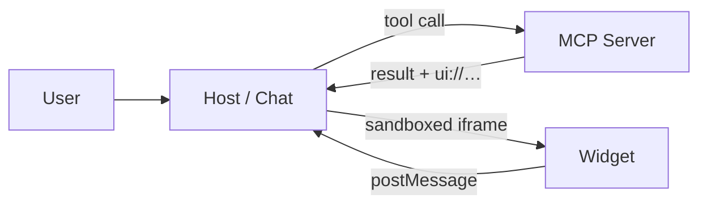
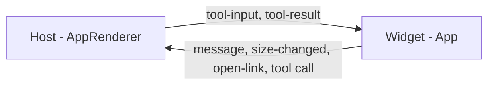
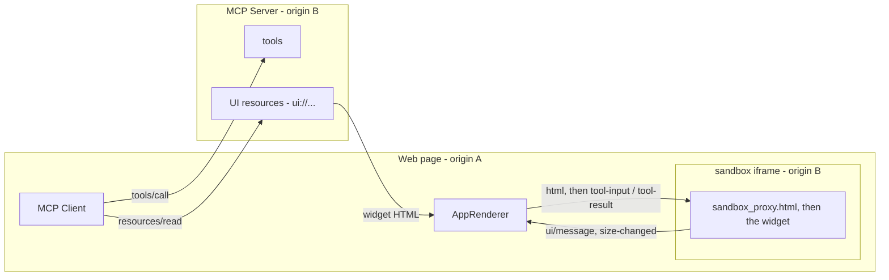

# MCP UI & MCP Apps

When a tool answers with an **interface** instead of text.

Note: the title of the talk is also the title of this section — everything up to here was the why, from here it is the how. From tools that answer with text to tools that answer with interfaces.

---

## The problem

An MCP tool can return exactly one thing: text. JSON at best, which the model then summarises… as text.

```json
{
  "content": [
    { 
      "type": "text", 
      "text": "Rome: 23°, clear sky" 
    }
  ]
}
```

> useless for components (lists, maps, ...) and apps

Note: this is not about looks. A conversation is an extremely narrow interface: every interaction costs a full round trip through the model.

---

# We need more than text to build UI

```typescript
 {
  content: [{
    type: "text",
    text: `5 properties match your search.\n${summary}`,
  }],
  structuredContent: {
    buildings: [],
    total: all.length,
    filters: { city, type, maxPrice, minRooms },
  },
};
```

This is what we will do with MCP UI!


---


Note: this is the classic placement — the widget rendered inline in the conversation stream. From the outside in: the chat message bubble, the host's UI container, the `AppRenderer`, the sandboxed `iframe`, and finally the widget itself with its property cards. **Next slide is the live demo** — the same picture, running: ask it *"immobili a Roma sotto i 500.000"* and let the widget appear inside the conversation. Then come back and we build it.


---


Note: same layers, seen in a full host application. The numbers walk outside-in: browser window, host app (localhost:5173), the widget container, the `AppRenderer` proxy layer, and the sandboxed `iframe` on the server's origin (localhost:3010) running `buildings-widget.html`. Keep these layers in mind — the next slide is the same picture as an architecture diagram.


---

## The idea

Along with the result, the tool declares **a UI to render**.



The host knows nothing about the widget: it downloads it from the server and runs it **isolated**.


---

<!-- demo: http://localhost:5173/#/ -->

## MCP Demo

> "immobili a Roma sotto i 500.000 euro"

---


## Two names, one mechanism

| | **MCP Apps** | **mcp-ui** |
| --- | --- | --- |
| what it is | the official **spec** | an **implementation**, plus DX |
| who | `modelcontextprotocol/ext-apps` | community project (idosal) |
| it defines | `ui://`, mimeType, `_meta.ui`, the postMessage protocol | `createUIResource`, `AppRenderer`, the sandbox proxy, adapters |
| if it vanished | there is no contract left | you rewrite ~200 lines, the contract survives |

They are not alternatives: **mcp-ui speaks MCP Apps**.

Note:
- the sentence to land: spec vs library, like the DOM and jQuery — if mcp-ui disappeared you would rewrite code, not the contract. Interop with another host comes from the spec, never from sharing a dependency
- **the naming trap**: "MCP UI" means two things — the generic idea (UI over MCP), which is what the talk title uses, and the `mcp-ui` project, which is what the `package.json` uses. Say it out loud once and nobody gets lost
- mcp-ui **predates** the standard: it is still self-described as an "experimental community playground for MCP UI ideas", and it used to ship its own postMessage protocol (`ui-lifecycle-iframe-ready` / `render-data` / `ui-action`). That protocol is deprecated today — and it is exactly what the `adapters` option translates (it comes back a few slides from here)
- **the third player**: OpenAI's Apps SDK, same idea, different wire, ChatGPT only. MCP Apps is the attempt to standardise that ground; the other mcp-ui adapter exists to run those widgets
- what the spec actually pins down is only what travels between two codebases written by different people: the `ui://` scheme, `text/html;profile=mcp-app`, `_meta.ui.resourceUri`, and the `ui/*` messages. Everything else — how you build the HTML, who serves the proxy — is library territory

---

## Who uses what, in the demo


```json [1-6|8-12]
// server/package.json — exposes the tools and the UI resources
{ 
  "@mcp-ui/server": "*.*.*", 
  "@modelcontextprotocol/sdk": "*.*.*",
  "@modelcontextprotocol/ext-apps": "*.*.*"
}

// client/package.json — calls the tool, mounts the widget
{ 
  "@mcp-ui/client": "*.*.*",
  "@modelcontextprotocol/sdk": "*.*.*"
}
```


Note: server side the demo uses both: `createUIResource` from mcp-ui, `registerAppTool` / `registerAppResource` from `@modelcontextprotocol/ext-apps/server`. Client side ext-apps is gone — nothing under `src/` imports it, `AppRenderer` is the only reason `@mcp-ui/client` is there. It does come back inside the **widget**, but over HTTP: the server serves the `app-with-deps` bundle at `/ext-apps.js` and the iframe imports the `App` class from there, so the widget needs no build step at all.

---

## The three pieces

| | |
| --- | --- |
| **Server** | exposes the tool **and** the UI resource (`@mcp-ui/server`) |
| **Host** | calls the tool and mounts the widget (`@mcp-ui/client`) |
| **Widget** | HTML/JS running inside a sandboxed iframe |

<p class="fragment">The widget cannot touch the host's DOM, the host's network, or the model.<br>It only speaks using <code>postMessage</code>.</p>

---

## The server: one endpoint

An Express route. One `McpServer` per session, tools registered into it.

```ts [1-9,16|11-14]
// Handle POST requests for client-to-server communication.
app.post("/mcp", async (req, res) => {
  let transport: StreamableHTTPServerTransport;
  // … 

  const server = new McpServer({
    name: "mcp-apps-demo",
    version: "1.0.0",
  });

  registerHelloTool(server);        // ← one tool + its UI resource
  registerWeatherTool(server);
  registerColorTool(server);
  registerBuildingsTool(server);

  await server.connect(transport);
});
```

Nothing here knows about UI yet. Everything that follows lives inside **one** of those `register…Tool` lines.

Note:
- this is `server/src/_index-simplified.ts`, trimmed of the session bookkeeping. The route itself is ordinary Express — MCP rides on `POST /mcp` and the `StreamableHTTPServerTransport` speaks the protocol; the same file also has `GET /mcp` (the server→client stream) and `DELETE /mcp` (session teardown), both one-liners onto the same transport
- **why inside the handler**: a new `McpServer` per session, kept in a map keyed by the `mcp-session-id` header. Sessions are stateful because the transport can push notifications back; a stateless variant exists if you don't need that
- `name` and `version` are what the client sees in the `initialize` response — the server's identity card, nothing more
- the four `register…Tool` are just my own functions, one file each: inside, `registerAppTool` + `registerAppResource`. The next slides open one of them
- this same Express app serves two more files on `3010`: `sandbox_proxy.html` and `ext-apps.js`. Both come back later — and the fact that they are served **here** and not from the host app is the whole security story

---

## The smallest possible widget

### Step1: Register the tool

```ts [1|3|5-12|14-15]
import { createUIResource } from "@mcp-ui/server";

function registerHelloTool(server: McpServer) {
  //  1. create the resource
  const helloUI = createUIResource({
    // the address: free-form after ui://
    uri: "ui://fb-server/hello-widget",  
    // content encoding: text or blob (base64)
    encoding: "text",
    // One inline HTML string. Can be a full HTML/JS app. No Build or frameworks. 
    content: { type: "rawHtml", htmlString: `<h1>Hello from MCP UI 👋</h1>` },
  });

  // 2...
  // 3...
}
```

That URI is an **address**, not a file: nothing resolves `fb-server` or `hello-widget`, they're just a made-up unique string. 

Note:
On its own this resource does nothing, until it gets published and pointed at by a tool — steps 2 and 3, coming up.

 this is the whole trick in five lines — a string of HTML wrapped in an MCP resource with a `ui://` URI. In the demo `htmlString` comes from an `.html` file sitting next to the tool (`readFileSync`): same resource, different source. A static `<h1>` needs nothing else: no handshake, no postMessage, no JS at all. Everything that follows (files on disk, tool data, the `App` class) is this, plus layers. On the options: `encoding: "text"` means plain HTML, `"blob"` means base64; there is also an `adapters` option that injects a compatibility shim for widgets written against **other** protocols (the legacy MCP-UI postMessage messages, or ChatGPT's Apps SDK) — a widget that speaks native MCP Apps, like all of ours, doesn't need it.

---

## Two ways to ship the UI

| `type` | what you send | when |
| --- | --- | --- |
| `rawHtml` | an HTML string | self-contained widgets, zero build |
| `externalUrl` | a URL in an iframe | a real app, already deployed |

```ts
content: { type: "rawHtml", htmlString: "<h1>Hello from MCP UI 👋</h1>" }

content: { type: "externalUrl", iframeUrl: "https://www.fabiobiondi.dev" }
```

Same `content` field, two shapes: the `type` decides which second key it takes — `htmlString` or `iframeUrl`.

Note: every example here uses rawHtml, read from an .html file sitting next to the tool — you edit it like an ordinary page. The union is discriminated: with `rawHtml` the payload key is `htmlString`, with `externalUrl` it is `iframeUrl`, and TypeScript will not let you mix them.

---

## Publishing the resource

Step 2: give the UI an address the host can fetch.

```ts [1-7|3|4|6]
// 2. the resource: the host fetches it with resources/read
registerAppResource(server,
  "hello_world_ui",       // a label for resources/list — links nothing
  helloUI.resource.uri,   // "ui://fb-server/hello-widget" — the address
  {},                     // optional: CSP, sandbox permissions, border
  async () => ({ contents: [helloUI.resource] }),
);
```

An ordinary MCP resource that happens to live at a `ui://` address. Still nobody points at it.

Note:
- resource and tool are **two different MCP primitives**. MCP UI invents nothing new, it just ties them together — the tie is the next slide
- the resource is an ordinary resource that happens to use a `ui://` URI: the host fetches it with `resources/read` exactly like any other
- the `_meta` here (4th argument, empty in the demo) is optional: per spec (`McpUiResourceMeta`) it carries `csp`, `permissions`, `domain`, `prefersBorder` — security and rendering, **not** the link. What marks the resource as a UI is the mimeType `text/html;profile=mcp-app`, which `registerAppResource` sets by default, plus the `ui://` scheme — the client checks both before mounting
- where does that label (`"hello_world_ui"`) actually show up? Only in the `resources/list` response, as the `name` field next to `uri` and `mimeType` — so in the MCP Inspector (`npm run inspector`), in a host's resource picker, or to a widget that asks the host for the resource list. **Never** on the rendering path: the host goes `tools/list` → `_meta.ui.resourceUri` → `resources/read`, and never calls `resources/list` at all. Which is why the demo's `weather_dashboard_ui2` — left over from renames — could stay wrong forever without anyone noticing
- the URI's shape is convention too: only `ui://` is enforced (`@mcp-ui/client` throws `Invalid UI resource URI` otherwise). Nothing resolves what comes after — it just has to be unique within the server
- `registerAppTool` / `registerAppResource` come from `@modelcontextprotocol/ext-apps`, not from mcp-ui: thin wrappers over `registerTool` / `registerResource` that take care of the `_meta`. You can do it by hand
- the last argument is the read callback: it runs on every `resources/read`, but the HTML was read from disk with `readFileSync` **once**, at registration time — the widget is not rebuilt on every call (in dev `tsx watch` restarts the server for you)

---

## Binding the tool to the UI

Step 3: the tool says **where** its UI lives — and answers.

```ts [1|2|3-7|9-16]
registerAppTool(server,
  "hello_world",          // the tool name: what the model calls
  { 
    description: "Shows a minimal 'Hello world' widget…",
    inputSchema: { name: z.string().optional() },
    _meta: { ui: { resourceUri: helloUI.resource.uri } } 
  },   

  async ({ name }) => {
    return {
      content: [
        { type: "text", text: `Hello ${name}` },   // ← for the model
      ],
      structuredContent: { name: name || "world" },  // ← for the widget
    };
  },
);
```

Three different strings, **one** of them does the binding — and **two** answers: prose for the model, data for the widget.

Note:
- **only the URI binds**, and it has to appear identical in two places: the address the resource is registered at (previous slide) and `_meta.ui.resourceUri` here. If the two don't match character for character the host finds nothing and silently falls back to text — the most annoying failure mode there is
- the three strings are **unrelated on purpose**: `"hello_world_ui"` is just the resource label, `"hello_world"` is the tool name the model calls, and the URI is the address. They could be pippo, pluto and topolino — the official ext-apps example pairs `"Weather View"` with `ui://weather/view.html`
- the handler is an **ordinary tool handler** — nothing UI-specific in it. The two channels leave together and go to different readers: `content` is prose the **model** will read, `structuredContent` is data the **widget** will read. Same call, two audiences
- **`structuredContent` is optional** in the protocol (`CallToolResult` declares it so), and a widget can technically read `content[0].text` too — don't. That string is written for the model and changes whenever you reword it; a widget that parses it is back to parsing prose, which is the problem we started from
- also worth knowing if someone asks: neither `structuredContent` nor the listeners are required for a widget to **appear**. A static `<h1>` with no `App` class renders perfectly (slide "The smallest possible widget"). The listeners are how a widget learns something about the call, not how it gets on screen
- host-side the order is `tools/list` → sees the `_meta` → `resources/read` → mounts the iframe. The resource is fetched once and reused: **N tools can point at the same UI**
- the point worth saying out loud: a host that knows nothing about MCP Apps ignores the `_meta` and still gets the textual `content`. **The tool keeps working everywhere** — you are adding a layer, not breaking compatibility

---

## The tool in one file

```ts [1-2|4-8|10-12|14-23]
const htmlPath = path.join(__dirname, "hello-widget.html");   // a plain .html file
const htmlString = fs.readFileSync(htmlPath, "utf8");

const helloUI = createUIResource({            // 1. create
  uri: "ui://fb-server/hello-widget",         //    the address, made up but unique
  encoding: "text",
  content: { type: "rawHtml", htmlString },
});

registerAppResource(server, "hello_world_ui", helloUI.resource.uri, {},
  async () => ({ contents: [helloUI.resource] }),   // 2. publish it for resources/read
);

registerAppTool(server, "hello_world", {      // 3. bind + answer
  description: "Shows a minimal 'Hello world' widget…",
  inputSchema: { name: z.string().optional() },
  _meta: { ui: { resourceUri: helloUI.resource.uri } },   // ← same address as above
},
  async ({ name }) => ({
    content: [{ type: "text", text: `Hello widget shown (${name}).` }],
    structuredContent: { name: name || "world" },
  }),
);
```

Note: the recap — the three steps we just built one at a time, as they really sit in a single file (`server/src/hello-tool.ts`). Nothing here is new except the first two lines: in the demo `htmlString` is read from `hello-widget.html` sitting next to the tool, so you edit the widget like an ordinary page. Worth saying: step 2, `registerAppResource`, is the one people forget — without it the host asks `resources/read` for that URI and gets nothing, so the widget never appears even though the tool answers fine. This is the whole server side: from here on we cross to the host, and then into the widget itself.

---

## What the host does

1. calls the tool
2. sees `_meta.ui.resourceUri` in the tool definition
3. fetches the resource with `resources/read`
4. mounts it in a sandboxed iframe and hands it the data

Note: four steps, zero hand-rolled routing. Next we open the thing that gets mounted at step 4 — the widget itself — and only after that the piece that ties all four together on the host side: `AppRenderer`.

---

## The widget: `hello-widget.html`

An ordinary HTML file. No build, no framework, no bundler.

```html [1-4|8-10,22|18-19|12-15]
<div class="hw-root">
  <div class="hw-title" id="hw-title">Hello, world!</div>
  <div class="hw-sub">Rendered by the MCP server — display only, no actions.</div>
</div>

<script type="module">
  // the App class, served by the MCP server itself
  import { App } from "http://localhost:3010/ext-apps.js";

  const app = new App({ name: "hello-widget", version: "1.0.0" });

  function greet(name) {
    if (!name) return;
    document.getElementById("hw-title").textContent = "Hello, " + name + "!";
  }

  // the model's arguments, then the server's structuredContent
  app.addEventListener("toolinput", (input) => greet(input?.arguments?.name));
  app.addEventListener("toolresult", (result) => greet(result?.structuredContent?.name));

  // listeners BEFORE connect() — from here on the host pushes the data
  await app.connect();
</script>
```

Note: this is `server/src/hello-widget.html`, the file `readFileSync` picked up on the recap slide — minus its `<style>` block, which is only cosmetics. Points to make: it is a plain page, opened in an editor like any other; the only import is the `App` class, and it comes over HTTP from our own MCP server (`/ext-apps.js`), so the widget needs no build step and the talk needs no network. `toolinput` fires first with what the model decided (it arrives while the tool is still running), `toolresult` second with what the server actually returned — `structuredContent` wins, which is why `greet` is called twice and the second call is the authoritative one. And the order rule again: listeners registered before `connect()`, or the first notifications land in the void. If you meet the `app.ontoolinput = …` setters in older examples: same payload, but deprecated since 1.7.x — `addEventListener` composes with other listeners and can be removed.

On `connect()`: it performs the `ui/initialize` handshake over postMessage with the host, and only after that does the host start pushing `ui/notifications/tool-input` and `ui/notifications/tool-result`. That is the whole reason the order matters. The class comes from `http://localhost:3010/ext-apps.js` — the `app-with-deps` bundle shipped inside the package and served by our own MCP server, so the widget needs no build step and the talk needs no network. And if you ever meet the old hand-rolled protocol (`ui-lifecycle-iframe-ready` / `render-data`): it is deprecated, and it is exactly what the `adapters` shim translates.

---

## Where that import comes from

The widget's only dependency, served by the MCP server itself.

```ts [1-4|6-8]
// the App class as a self-contained ESM bundle, shipped inside the package
const extAppsBundle = require.resolve(
  "@modelcontextprotocol/ext-apps/app-with-deps",
);

app.get("/ext-apps.js", (_req, res) => {
  res.sendFile(extAppsBundle);
});
```

Six lines of Express. The widget writes `import { App } from "http://localhost:3010/ext-apps.js"` 

> **"no build, no bundler and no CDN by choice: see the next slide".**.

Note: ext-apps   È il runtime lato widget di MCP Apps: l'unica cosa che il tuo .html deve avere per essere un widget invece di una pagina qualsiasi. Esporta una classe pubblica,
  App, più una manciata di helper.

 Molto più dei 5 metodi in tabella nel deck (decks/07-mcp-ui-basics.md:457). Dalle firme reali in app.d.ts:

  - handshake e stato: connect(), getHostCapabilities(), getHostVersion(), getHostContext()
  - in ingresso: eventi toolinput, toolinputpartial (streaming degli argomenti mentre il modello li scrive), toolresult, toolcancelled
  - verso il server, senza passare dal modello: callServerTool(), readServerResource(), listServerResources()
  - verso il modello: sendMessage(), e — questa è ghiotta — createSamplingMessage(): il widget può chiedere all'host di fare una chiamata LLM per suo conto. E
    updateModelContext(): il widget scrive nel contesto del modello
  - verso l'host: openLink(), downloadFile(), requestDisplayMode() (es. fullscreen), sendSizeChanged() + setupSizeChangedNotifications() (che ti attacca un
    ResizeObserver da solo), requestTeardown(), sendLog()
  - tema: applyDocumentTheme(), applyHostStyleVariables(), applyHostFonts(), getDocumentTheme() — il widget eredita i colori e i font dell'host invece di stonare
    dentro la chat

-

OBIEZIONI
 La nota (le due obiezioni, in ordine di frequenza)

 - "e un CDN?" — funziona, ed è una scelta legittima:
   import { App } from "https://cdn.jsdelivr.net/npm/@modelcontextprotocol/ext-apps@1.7.5/dist/src/app-with-deps.js".
   Passa anche da un CDN che serve file grezzi, perché il bundle non ha import. Il prezzo:
   (a) la wifi della sala, (b) la CSP: resourceDomains di default è vuoto = nessuno
   script esterno, quindi vai dichiarato nel _meta e l'host deve approvarti — schermata
   bianca se dice no; (c) supply chain: chi controlla quell'URL esegue codice nell'iframe
   dei tuoi utenti, quindi versione pinnata obbligatoria; (d) il CDN vede l'IP di ogni
   utente. CDN e self-hosting risolvono lo stesso problema (dare un URL): cambia di chi
   è il dominio da far approvare
 - "e incollare il bundle nell'HTML?" — l'unico modo di evitare l'URL: 332 KB × 4 widget
   dentro il payload MCP, mai in cache, e il file non è più apribile in un editor
 - in produzione: stesso schema del demo, con un dominio vero al posto di localhost,
   versionato e in cache

---


## The host, in React

Connect, call the tool, hand the result to `AppRenderer`. Nothing else.
 
```tsx [1|2|5-6|8-13|18-23]
const TOOL = { name: "hello_world", input: { name: "Fabio" } };
const SANDBOX = { url: new URL("http://localhost:3010/sandbox_proxy.html") };

export function MinimalTool() {
  const [client, setClient] = useState<Client | null>(null);
  const [result, setResult] = useState<any>();

  useEffect(() => {
    createMcpClient("http://localhost:3010/mcp").then(async (c) => {
      setClient(c);
      setResult(await c.callTool({ name: TOOL.name, arguments: TOOL.input }));
    });
  }, []);

  if (!client) return <p>Connecting to MCP server…</p>;

  return (
    <AppRenderer
      client={client}
      toolName={TOOL.name}
      toolInput={TOOL.input}
      toolResult={result}
      sandbox={SANDBOX}
    />
  );
}
```

Note: worth saying out loud, because the words collide: **this component is the host** — it owns the conversation, decides to call the tool and mounts the widget. The MCP **client** is one line inside it, the object `createMcpClient` returns: a single connection to a single server. Host = the app, client = its connection. This is `MinimalTool.tsx` from the demo, trimmed only of the unmount cleanup (`mcp?.close()`). No `onMessage`, `onSizeChanged`, `onFallbackRequest`: a widget that just displays data doesn't need them — they show up in the next examples, once the widget starts talking back. `createMcpClient` is three lines: `new Client(...)` with `@mcp-ui/client`'s `UI_EXTENSION_CAPABILITIES`, then `connect()` over a `StreamableHTTPClientTransport`.

---

## The real host: the model decides

`MinimalTool` hard-codes the call. Here nobody knows in advance which tool will run — or whether one runs at all.

```ts [1|3-4|6|7]
const ai = new GoogleGenAI({ apiKey });

const chat = ai.chats.create({
  model: "gemini-2.5-flash",
  config: {
    tools: [mcpToTool(client)],                     // the whole MCP server, as functions
    automaticFunctionCalling: { disable: true },    // ← we run the tool, not the SDK
  },
});
```

One line publishes every tool to the model. The line under it is what makes widgets possible at all.

Note:
- `mcpToTool(client)` reads `tools/list` off the MCP client and turns each `inputSchema` into a function declaration. Add a tool on the server, restart, the model can call it — no mapping table on the host, which is the whole promise of MCP cashed in one line
- **`automaticFunctionCalling: { disable: true }` is the reason this slide exists.** By default the SDK executes the tool for you, in the background, and hands you back only the final prose. You would never hold the `CallToolResult` — so you could never mount a widget with it. A generative-UI host *has* to run the loop by hand. This is the single line people miss, and the failure is silent: everything works, no widget ever appears
- Gemini here because the demo uses `@google/genai`, but the shape is identical with any provider's function calling
- the chat session is cached in a `useRef` and rebuilt only when the API key changes: the conversation must survive re-renders, otherwise the model loses its history at every keystroke
- `GeminiTest.tsx:113-129`

---

## The loop, by hand

Ask the model, look for a function call, and from there it is a loop.

```ts [1-2|3|5|6-7|9-10|12-14|15]
// the model's answer: prose, or a request to call a tool
let result = await chat.sendMessage({ message: userText });
let functionCall = getFunctionCall(result);   // digs into candidates[0].content.parts

while (functionCall) {
  const { name, args } = functionCall;
  setToolData({ callId, name, input: args });                       // ① widget on screen

  const toolResult = await client.callTool({ name, arguments: args });
  setToolData({ callId, name, input: args, result: toolResult });   // ② same widget, with data

  result = await chat.sendMessage({                                 // ③ back to the model
    message: [{ functionResponse: { name, response: toolResult } }],
  });
  functionCall = getFunctionCall(result);     // same two lines as above: another tool?
}
```

Two `setToolData`, **one** `callId`: the widget appears *before* its data exists.

Note:
- this is why the widget has two listeners: ① mounts it and pushes `toolinput` — what the model *decided*, while the tool is still running (a spinner with the right city name already in it); ② pushes `toolresult`. Same `callId` = same iframe, no remount, no flash
- ③ is the part people forget: the tool result goes **back to the model** too. Same `CallToolResult`, two readers — the model reads `content`, the widget already read `structuredContent`. One call, both audiences, exactly as the tool handler promised
- it is a `while`, not an `if`: the model can chain tools, and each one mounts its own widget in turn
- the two lines above the loop and the last line inside it are **the same pair**: send, then look for a function call. That is the whole shape — the loop just runs it again as long as the model keeps asking for tools
- `getFunctionCall` is a three-line local helper, not an SDK function: `res.candidates?.[0]?.content?.parts?.find(p => p.functionCall)?.functionCall`. Pure Gemini plumbing — with another provider it is a different shape, same idea
- the only thing still trimmed off the slide: `callId`, which is `++callIdRef.current`, a counter in a ref
- `GeminiTest.tsx:152-194`

---

## The same `AppRenderer`, wired up

It lives **inside the tool loop**: every `setToolData` re-renders it, every new `callId` remounts it.

```tsx [1|3|4-5|6|7]
{toolData && (
  <AppRenderer
    key={toolData.callId}                       // ← a new sandbox per tool call
    client={client} 
    sandbox={sandbox}
    toolName={toolData.name} 
    toolInput={toolData.input} 
    toolResult={toolData.result}
    onMessage={async (p) => { pushIntoChat(p); return { isError: false }; }}
    onSizeChanged={(d) => setWidgetSize(d)}     // the container actually resizes
  />
)}
```

Note:
- **the point of the slide**: the renderer is not mounted once and left alone, it sits in the tool loop. The loop writes `toolData`, React re-renders; when the `callId` changes the iframe is thrown away and rebuilt — one widget per call, never recycled. That is the `document.write` consequence we meet again in "One proxy, one widget"
- `sandbox` comes from a `useMemo` (`GeminiTest.tsx:230`): a new `URL` object per render would re-trigger the renderer's iframe effect and abort the handshake. Rare bug, ugly to debug
- `onSizeChanged` really resizes the container — the demo even prints `width x height` in the corner so you can watch the widget negotiate its own size
- there is a fourth handler, `onFallbackRequest`, for custom widget → host commands: we meet it with the color picker in the next section
- `GeminiTest.tsx:433-473`

---

## Host ↔ widget communication

Two directions, one channel: `postMessage` across the sandbox boundary.



| | |
| --- | --- |
| **host → widget** | the host **pushes**. The widget can only listen |
| **widget → host** | the widget **asks**. The host decides — and may refuse |

No DOM, no network, no model: everything the widget wants, it has to request.

Note: this is the frame for the next two slides — first the catalogue of what a widget can ask for, then one request end to end. The sentence to land: the widget never *performs* anything outside its own iframe. It cannot resize itself, cannot open a tab, cannot write in the chat. It asks, and the host is free to say no — which is precisely why you can embed a widget written by someone else. Incoming we already saw: `toolinput` and `toolresult`. This slide is about the arrow going the other way.

---

## From the widget outwards

Every `App` method is JSON-RPC over `postMessage` underneath.

| call | wire method | effect |
| --- | --- | --- |
| `app.sendMessage(…)` | `ui/message` | writes into the conversation, the model replies |
| `app.sendSizeChanged(…)` | `ui/notifications/size-changed` | asks the host to resize it |
| `app.openLink(…)` | `ui/open-link` | opens a URL |
| `app.callServerTool(…)` | `tools/call` | calls an MCP tool |
| `app.request({ method: "x/…" })` | *custom* | lands in `onFallbackRequest`: drives **the host app** |

Note: the first four are standard. The last one is the side door — the host decides what it accepts. Three of these five come back with a slide of their own in the examples: `sendSizeChanged`, `sendMessage` and the custom `request`. `openLink` and `callServerTool` you will only meet here — worth one sentence each: `callServerTool` lets the widget call an MCP tool **directly**, without a round trip through the model (no tokens, no latency, deterministic), while `sendMessage` goes through the model on purpose, when you *want* it to decide.

---

## One request, both sides

The widget **asks**; the host receives it as a prop and decides.

<div style="display: flex; gap: 2rem; align-items: flex-start;">
<div style="flex: 1;">

**In the widget** — `hello-widget.html`

```js
card.onclick = () => {
  app.openLink({
    url: "https://www.fabiobiondi.dev",
  });
};
```

</div>
<div style="flex: 1;">

**In the host** — `AppRenderer`

```tsx
<AppRenderer
  onOpenLink={async ({ url }) => {
    if (!allowed(url)) throw new Error("no");
    window.open(url, "_blank");
    return {};
  }}
/>
```

</div>
</div>

No `window.open` inside the iframe: it is sandboxed, cross-origin, and it would not work. `ui/open-link` travels, the host opens the tab.

Note: the shape is the same for all of them — a method on `App` in the widget, a matching `on…` prop on `AppRenderer` in the host: `sendMessage` → `onMessage`, `sendSizeChanged` → `onSizeChanged`, `openLink` → `onOpenLink`, `callServerTool` → `onCallTool`, and any custom method → `onFallbackRequest`. Two things to say out loud here. First: the host handler is where the **policy** lives — that `if (!allowed(url))` is not decoration, it is the whole reason this is a request and not an action; a widget from a third-party server cannot open anything it likes in your app. Second: the handler is `async` and returns a value, so the widget gets an answer back — the same mechanism the colour picker uses in the examples to drive the host's own background.

---

## The whole picture



**Two origins** (A can't touch B) and **two transports**: HTTP on the left, `postMessage` on the right.

Note: the one thing worth pointing at out loud — after step 3 the proxy **is** the widget: `document.write` replaced that document, so steps 4 and 5 are the widget talking to the host **directly**, `window.parent` with no relay in between. The proxy's whole job is steps 1 and 2. Note also that server and sandbox share origin B here only because it's a demo on localhost: what matters is that they are *not* origin A.

---

## Sandbox

`AppRenderer` doesn't put the widget straight into the page: it mounts an iframe pointing at a **proxy**.

```tsx [1|3-8|7]
const SANDBOX = { url: new URL("http://localhost:3010/sandbox_proxy.html") };

<AppRenderer
  client={client}
  toolName={TOOL.name}
  toolResult={result}
  sandbox={SANDBOX}     // ← the iframe points here, not at the widget
/>
```

- the proxy is served from a **different origin** than the app (`3010` vs the host) — that's what actually isolates it, not the `sandbox` attribute
- no cookies, no storage, no host DOM reachable from the widget: only `postMessage`

Note: `@mcp-ui/client` still sets `allow-scripts allow-same-origin allow-forms` on the proxy iframe — "same-origin" here means "keep your own origin," not "share the parent's." The real isolation comes from that origin being `localhost:3010`, different from the host's: the proxy's cookies and storage stay invisible to the host and vice versa. Cross-origin also works around a Chrome bug in WindowProxy identity between same-origin iframes.

---

## The proxy is a blank page

`public/sandbox_proxy.html` — served static by the MCP server. That's all of it.

```html
<!doctype html>
<html>
  <head>
    <meta charset="UTF-8" />
    <title>Sandbox Proxy</title>
    <style>
      html, body { margin: 0; padding: 0; width: 100%; height: 100%; }
    </style>
  </head>
  <body>
    <script>
      /* twenty lines — next slide */
    </script>
  </body>
</html>
```

An empty page whose only two qualities are: it lives on **the server's origin**, and it knows how to receive HTML.

Note: this is the actual file from the demo, `demo/mcp-ui-demo/public/sandbox_proxy.html`, served by `app.get("/sandbox_proxy.html", …)` next to the `/mcp` and `/ext-apps.js` routes. Two things to say. First, there is genuinely nothing here — no framework, no dependency, no styling beyond "fill the iframe": people expect the sandbox to be a heavy piece of machinery, and it is a blank page. Second, and this is the part that matters: the file is trivial, but **who serves it is not**. It is on `localhost:3010`, the server's origin, not the host app's — that single fact is what makes the widget unable to touch the host's cookies, storage and DOM. The isolation is in the URL, not in the code.

---

## Inside the sandbox proxy

Minimal handshake: the proxy says "ready", the host hands it the HTML, it writes it.

```js [1-3|5-13|15-19]
window.addEventListener("message", (event) => {
  const data = event.data;
  if (!data || typeof data !== "object") return;

  if (data.method === "ui/notifications/sandbox-resource-ready") {
    const { html } = data.params || {};
    if (html) {
      document.open();
      document.write(html);
      document.close();
    }
  }
});

// Signal that the sandbox proxy is ready
window.parent.postMessage(
  { method: "ui/notifications/sandbox-proxy-ready", params: {} },
  "*",
);
```

Note: this is (almost) all of `sandbox_proxy.html` — the minimal version from the official mcpui.dev walkthrough, simplified today from an earlier version with a nested iframe. `@mcp-ui/client` listens for exactly that first `postMessage` (`ui/notifications/sandbox-proxy-ready`) before sending the widget's HTML, with a 10s timeout: if the proxy never sends it, `AppRenderer` errors out with "Timed out waiting for sandbox proxy iframe to be ready" and the widget never loads. `document.write()` replaces the entire document — listeners included — so this minimal version can't receive a second widget in the same iframe.

---

## One proxy, one widget

Direct consequence of `document.write()`: the proxy has to be **remounted** on every tool call.

```tsx
<AppRenderer key={toolData.callId} … />
```

One prop more than before — and it is the whole architecture.

- `key={callId}` forces React to throw away the old iframe and mount a fresh one
- every widget starts from a clean `document.write()`, never a recycled one

Note: this is today's simplification trade-off. The earlier version used a nested iframe (`srcdoc`) inside the proxy, so the proxy itself survived multiple tool calls and only the inner iframe got swapped. Here that reuse is lost, but you gain a ~20-line file readable in a single slide — and that's exactly what a live demo needs, where every tool call is already a fresh `<AppRenderer key={callId}>` anyway.
