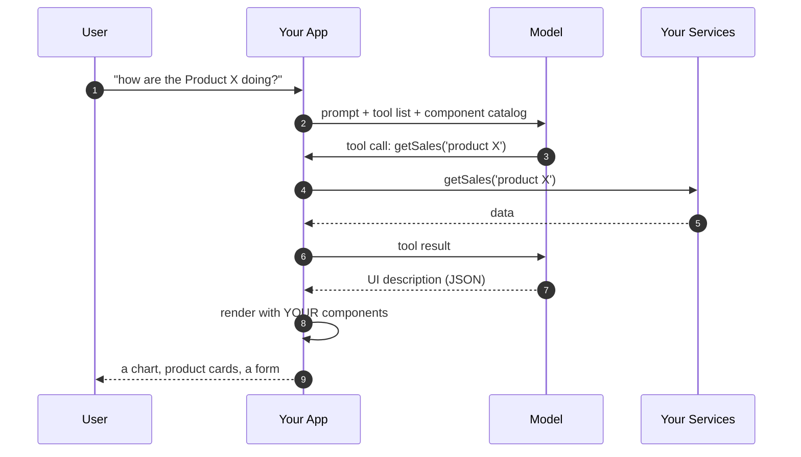
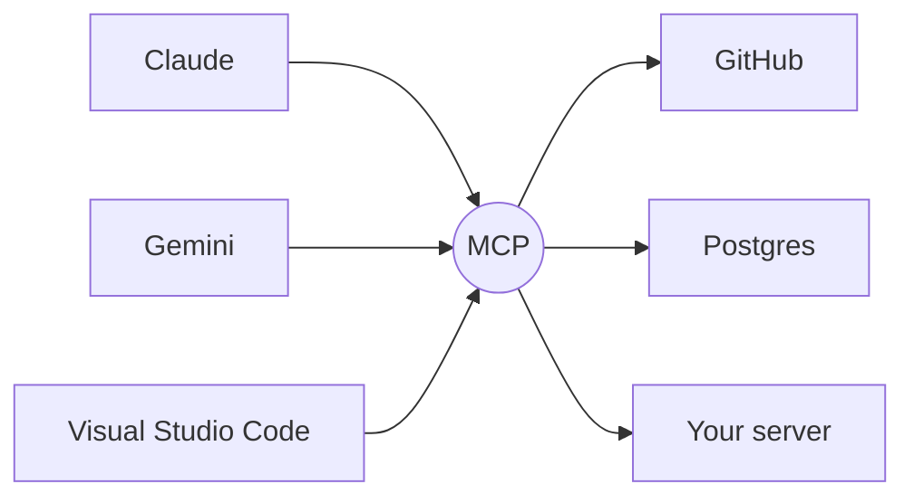
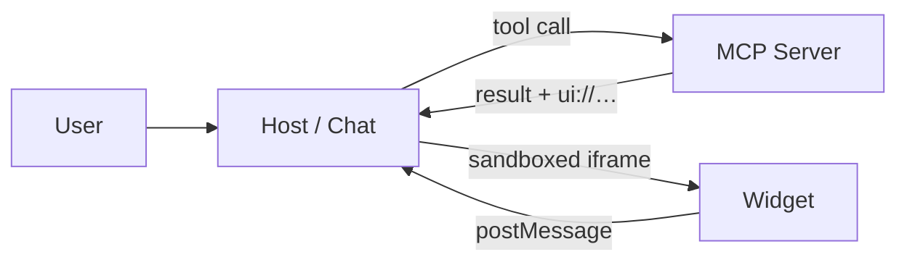

<div class="cols" style="--cols-align: center">
<div class="col" >

# Generative UI

The interface is no longer fully designed at build time.

<br />

### by Fabio Biondi

</div>
<div class="col">


</div>
</div>

Note: opening line I want to land: for twenty years we have shipped every pixel in advance. Generative UI is the first serious crack in that assumption — and it is NOT "the AI writes my components at runtime". That's the misconception I want to kill in the next 15 minutes.

---

<!-- .slide: class="author-slide" -->

<div class="author-photo">
  
  
  
  
  
  
  
  
</div>


<div class="author-bio">
  <h1>Fabio Biondi</h1>
  <ul>
    <li>Freelance</li>
    <li>AI Gen & Front-end <strong>Training for Teams</strong></li>
    <li><strong>Google Developer Expert (Angular)</strong></li>
    <li><strong>Speaker</strong> &amp; Content Creator</li>
    <li><strong>Community</strong> Founder</li>
    <li><strong>LearnByDo.ing</strong> creator</li>
  </ul>

  <p class="author-stack">Main Skills: TypeScript · Angular · React · Next.js · Gemini · Claude</p>
  <p class="author-meta">❤️ MTB · Snowboard · Tennis · Skate — <strong>FabioBiondi.dev</strong></p>


<br />

## _fabiobiondi.dev_

</div>

Note: thirty seconds, no more. The credentials matter only to say why I spent the last months inside this protocol.

---

## Every screen you have ever shipped…

# …was designed **before** and then added to your app

Note: ask the room: how many screens in your app exist only because of one edge case? The filter panel nobody uses. The 12 tabs. The dashboard with 40 widgets because we could not decide which 6 mattered.

---

## The problem we actually have

- We design *one UI for every user*, then hide 90% of it behind filters, tabs and menus
- Every new use case = a new screen, a new route, a new sprint
- The user knows what they want: they just can't **say** it to a form
- Search boxes often return links. Dashboards return everything. Neither returns *an answer*

<p class="fragment">Chat solved the <b>input</b> problem.<br>It gave us back a <b>wall of text</b> as output.</p>

Note: this is the setup for the whole talk. Chat was a huge UX regression in one specific way: we replaced rich, clickable, scannable interfaces with a paragraph. Generative UI is the attempt to get the interface back without going back to the static screen.

---

## ... but "text" is a terrible output format

<div style="display: flex; gap: 2.5rem; align-items: flex-start;">
  <div style="flex: 1;">
    <p><strong>What the model says</strong></p>
    <blockquote>Running shoes made €6,700 this month, up 12% on last month. Week one was €1,200, week two €1,810, week three €1,640 and week four €2,050. Your last order, A-99213, was delivered on the 14th.</blockquote>
  </div>
  <div style="flex: 1;">
    <p><strong>What the user would like</strong></p>
    <div style="padding: 1em 1.2em; border: 1px solid rgba(148, 163, 184, 0.4); border-radius: 8px;">
      <div style="font-size: 0.75em; opacity: 0.75;">Running shoes — revenue, by week</div>
      <div style="display: flex; align-items: flex-end; gap: 0.8rem; height: 130px; margin: 0.8em 0 0.4em;">
        <div style="flex: 1; height: 59%; background: #14b8a6; border-radius: 4px 4px 0 0;"></div>
        <div style="flex: 1; height: 88%; background: #14b8a6; border-radius: 4px 4px 0 0;"></div>
        <div style="flex: 1; height: 80%; background: #14b8a6; border-radius: 4px 4px 0 0;"></div>
        <div style="flex: 1; height: 100%; background: #14b8a6; border-radius: 4px 4px 0 0;"></div>
      </div>
      <div style="display: flex; gap: 0.8rem; font-size: 0.65em; opacity: 0.7;">
        <div style="flex: 1; text-align: center;">1200</div>
        <div style="flex: 1; text-align: center;">1810</div>
        <div style="flex: 1; text-align: center;">1640</div>
        <div style="flex: 1; text-align: center;">2050</div>
      </div>
      <div style="margin-top: 1em; padding: 0.5em 0.9em; border: 1px solid #14b8a6; border-radius: 6px; font-size: 0.8em; display: inline-block;">Download PDF</div>
    </div>
    <p style="font-size: 0.7em; opacity: 0.7;">One chart, one button. Zero sentences.</p>
  </div>
</div>

Note: this is the single slide that explains the whole idea. Same information, same model, same tool call — the difference is only what we do with the result. Keep this one on screen a few seconds longer than feels comfortable. Same shape as the JSON we will look at later in the talk — promise the room we will build exactly this, then keep the promise.

---

## Demo Hashbrown: generated dashboard

<video src="assets/hashbrown/DashboardDemo6.mp4" controls muted playsinline preload="metadata" style="width: 80%; aspect-ratio: 1920 / 1080; display: block; margin: 0 auto;"></video>

Note: the model does not draw this dashboard — it picks the widgets and the app renders them. Same components you already ship, assembled at runtime around the question that was actually asked.

---

## One definition, and one anti-definition

> **Generative UI**: the model does not produce the interface. <br /> It produces a **description** of an interface, using components *you* wrote, and your app renders it.

<blockquote class="fragment"><b>It is <i>not</i>:</b> an LLM emitting raw HTML/CSS/JS that you <code>innerHTML</code> into the page.<br>That is a security incident with a nice demo.</blockquote>

<p class="fragment" style="text-align: center;"><b>The model picks from a menu. It does not cook.</b></p>

Note: "the model picks from a menu, it does not cook" — this is the line I want people to repeat at the coffee break. Everything else in the talk is a consequence of it.

---

## Three things an LLM can do for you

Prompt: *"who was Ada Lovelace?"*

**1. Generate text**: Useful, **unstructured**, **unrenderable**.

```txt
"Ada Lovelace was a 19th-century mathematician who wrote what is now considered the first algorithm..."
```

**2. Generate structured output**: You hand it a **schema**, you get back JSON that fits it. Every time.

```json
{ "name": "Ada Lovelace", "role": "Mathematician", "skills": ["Analytical Engine", "Algorithms", "Symbolic logic"] }
```

**3. Call your functions**: "tools". You describe what your app can do; the model decides *when* to call it. 

```ts
tools: [ getSales, findPerson, createTicket ]
```

<blockquote class="fragment">Generative UI = <b>#2 and #3</b>, pointed at your component library instead of your database.</blockquote>

Note: 60-second primer, because everything after this builds on it. Do not rush this slide — if they miss "structured output", nothing later makes sense. The analogy that works: structured output is a TypeScript interface the model is forced to satisfy.

Read the three blocks as one story, not three features: same question, three shapes of answer. The first is a paragraph — everything is in there and none of it is reachable; to put the role in a `<h3>` you would have to parse English. The second is the same knowledge with the structure kept, and the only thing that changed is that you supplied a schema.

Then the reveal, which pays off five slides later: **that JSON is not an example I invented.** Those three fields are literally the props of the `UserCard` component we are about to look at — `{ name, role, skills }`. Structured output is already generative UI as soon as the schema you hand the model happens to be the props of one of your components. That is the whole trick, and the rest of this section is just about who picks *which* component.

On block 3, say that these are ordinary application functions — `fetchSales` is the one behind the sales demo later. Nothing about them is AI-specific; the model only decides when they should run.

---

## The mechanism, in one picture



The model never touches the DOM, the network, or your state.

Note: walk it slowly, arrow by arrow. The two things to point at: step 2 (we send a *catalog*, not a design) and step 7 (JSON, not markup).

---

## Start from the components you already have


```tsx
<UserCard name="Valentino Rossi" role="Rider" skills={['MotoGP', 'GT racing', 'VR46']} />
```

```tsx
// A simple card with "name", "role" and a "skills" list
export type UserCardProps = { name: string; role: string; skills: string[] };

export function UserCard({ name, role, skills }: UserCardProps) {
  return (
    <div className="card">
      <h3>{name}</h3>
      <p>{role}</p>
      <ul>
        {skills.map((s) => <li key={s}>{s}</li>)}
      </ul>
    </div>
  );
}
```

No AI import, no base class, no decorator. 

A component you wrote months ago, styled and tested before any model existed.

Note: start here on purpose — the room needs to see that nothing about this component is special before I claim a model can assemble it. No decorator, no base class, no `data` envelope: it is the same `UserCard` that is already in your design system, and it was written, reviewed and tested long before any of this.

`UserCard` is deliberately the easy case: props in, pixels out. Whatever is in `name` is what appears in the `<h3>`.

End on the call site, because it is the hinge of the whole section: today *you* type that line, at build time, for a page you designed in advance. Nothing about the component is going to change in the next slide — the only thing that changes is **who writes that line, and when**. Hold that thought — two slides from now there is a component that does not work like this, and the difference is the whole point of the section.

---

## One tool for every component

```ts [1|3|4|5-13]
const tools: FunctionDeclaration[] = [
  {
    name: 'UserCard',
    description: 'Introduce a person: name, role and a few skills',
    parameters: {
      type: Type.OBJECT,
      properties: {
        name: { type: Type.STRING },
        role: { type: Type.STRING },
        skills: { type: Type.ARRAY, items: { type: Type.STRING } },
      },
      required: ['name', 'role', 'skills'],
    },
  },
  // …one entry per component in the catalog
];
```

> The `description` is the only manual the model gets: <br />
the schema can enforce that `name` and `role` are string, `skills` is an array of string and so on...


<blockquote class="fragment">The <code>parameters</code> schema is simply <code>UserCardProps</code> (see previous slide).</blockquote>


Note: walk the three steps of the highlight: the name is the one the model will call back, the description is how it decides, the schema is what it is allowed to send. Nothing here is framework magic — it is a plain object literal that happens to be shipped to a model.

The fragment is the reason `UserCard` came first: schema and props are the same three fields, so the declaration reads like the TypeScript type written twice. Every generative-UI tutorial you will find stops here. Say that out loud, then turn the page — because the interesting component is the one that does *not* work like this.

---

## Another component... that fetches data

```tsx
<SalesReport year={2025} category="shoes" />
```

```tsx 
export type SalesReportProps = { year: number; category?: string };

export async function SalesReport({ year, category = 'all' }: SalesReportProps) {
  const data = await fetchSales(year, category); // your DB, on the server

  return (
    <div>
      ... render data ...
    </div>
  );
}
```


Note: this is the component the room will remember, so slow down. `UserCard` was handed everything it renders; this one is handed two values and goes to get the rest.

Point at the `await` on the highlighted line and say it out loud: an ordinary **async server component**, the kind you already write in Next.js. No `useEffect`, no loading state, no client fetch — the data is loaded where the component is rendered, with your session and your row-level security, and only HTML crosses to the browser. `fetchSales` is a fake `SELECT` in the demo, but in your app it is the same service your existing dashboard already calls. (Honesty note if someone asks: the demo running later is a plain Vite SPA, so there the same component does the fetch in a `useEffect` — same idea, more ceremony.)

The reason this matters is not architecture, it is trust. The model has no idea what we sold in 2024 and must never pretend to. Say it plainly, then show its tool: **the model is choosing the query, not answering it.**

---

## A tool that describes the question, not the data

```ts [1-2|4|5-10|11-18]
const tools: FunctionDeclaration[] = [
  // ... other tools
  {
    name: 'SalesReport',
    description: `
      Total sales / revenue for one calendar year, broken down by month. Use it whenever 
      the user asks about sales, revenue or turnover of a given year. Send ONLY the year 
      (and the category, if the user named one): the component queries the database 
      itself. Never put sales figures in a BarChart — you do not have them.
    `,
    parameters: {
      type: Type.OBJECT,
      properties: {
        year: { type: Type.NUMBER, description: 'The calendar year, e.g. 2024' },
        category: { type: Type.STRING, enum: ['all', 'shoes', 'clothing', 'accessories'] },
      },
      required: ['year'],
    },
  }
```


Note: this is the second half of the previous slide, so open by pointing at the shape: same three fields, same array, and yet the schema has *shrunk*. `UserCard` declared everything it renders; this one declares two values and produces a whole report.

The size of a tool's schema is not the size of its UI — and that is a decision you make when you write it, not something the model gets to choose. Say the sentence that sums up the whole section: **the model is picking the query, not answering it.**

Then set up the next slide: everything that makes this tool safe is in the four lines of English above the schema, not in the schema.

---

## Three fields

Three things travel to the model: the **name**, the **description**, the **schema of the props**.

```ts [2|3|4-8]
{
  name: 'ToolName',       // WHICH component: the model sends this name back
  description: '....',    // WHEN to reach for it: prose, and the field that decides
  parameters: {           // WHAT it may send you: and nothing outside this
    type: Type.OBJECT,
    properties: { ... },
    required: [],
  },
}
```


<blockquote class="fragment">TIP: an <b>MCP tool</b> is declared with these same three fields: it just spells <code>parameters</code> as <code>inputSchema</code>.</blockquote>

Note: the same tool as the previous slide, cut down to the bone — three fields, one comment each. Read the three comments out loud in order and the whole mechanism is on screen at once; this is the slide to photograph.

The `description` field is the highest-leverage text in the entire system. Vague description, wrong component. I have wasted whole afternoons on this.

That last sentence is there because of a real failure, and it is worth confessing on stage. The catalog also contains a generic `BarChart` that takes `{ label, value }[]`. Without that line the model answers "how much did we sell in 2024?" by calling `BarChart` with twelve plausible, confident, entirely invented numbers. It looks perfect. It is fiction. One sentence of prose moved it to the tool that actually knows.

Point at the split: `enum` and `required` are what the SDK can check — if the model sends `category: 'hats'` I never see the call. The sentences here are what only the model can honour, and no amount of JSON Schema will express them.

Then land the fragment and move on — do not explain MCP yet. It is only a hook: when `tools/list` shows up later, the room should recognise the shape instead of learning it.

---

## Configure tools (in Gemini SDK)

```ts [1,3,4|5|7-9|10|14-17]
const ai = new GoogleGenAI({ apiKey });

const res = await ai.models.generateContent({
  model: 'gemini-3.8-flash',
  contents: 'Introduce Ada Lovelace, and tell me how much we sold in 2024.', // User Prompt
  config: {
    systemInstruction:
      'You are a UI generator. Call the tools that best answer the request. ' +
      'Call more than one when the request needs more than one component.',
    tools: [{ functionDeclarations: tools }]
  }
});

// one function call per tool 
const ui = (res.functionCalls ?? []).map(
  (call) => ({ component: call.name, props: call.args }) as UISpec,
);
```

The model does not return a UI. 

It returns **which of your functions (one or many) to call, and with what arguments**.

Note: two things to point at. `mode: ANY` is the whole trick — it forbids prose, so the answer is always a UI. And `res.functionCalls` is a *list*: this is the jump from "the model picks a component" (level 3) to "the model composes a screen" (level 4) and it costs exactly one line of code. Say that the SDK already validated the arguments against the schema before handing them to me — if the model invents a prop, I never see it.

---

## Client: render components from Catalog

```tsx
const UIKIT = { Alert, UserCard, BarChart, SalesReport };

ui.map((item, i) => {
  const Component = UIKIT[item.component];
  return Component ? <Component key={i} {...node.props} /> : null
});
```

Anything outside the registry simply does not exist. No markup, no `innerHTML`, no exploit.


Note: the renderer is nine lines and there is no framework in sight — that is the point, and it is worth saying that everything else in this talk is this same idea with more plumbing. The `registry` lookup is the security boundary: it is a whitelist by construction, not a filter someone has to remember to write.

The fragment is the payoff of the last four slides, so pause on it. Put the two entries side by side out loud: `UserCard` carries its whole payload — if the model gets Ada's role wrong, a wrong role is what renders. `SalesReport` carries `{ "year": 2024 }` and nothing else, so there is no figure in that JSON *to* get wrong. Same pipeline, same nine-line renderer, two very different blast radii — and choosing which one a component gets is a decision you make when you write its schema, not something the model decides for you.

The other thing to say, because someone always asks: `props` came back already validated against the schema. If the model had sent `year: "last year"` the SDK would have rejected the call before my code ever saw it.

---

<!-- demo: http://localhost:5174/tools -->

## Live: one prompt, a composed screen

> "introduce Ada Lovelace and chart her three main contributions by impact"

> "how much did we sell in 2024?"

Note: this is the code from the last four slides, running. Type the prompt, then switch to the **raw JSON** panel before the rendered one — the room has to see that what came back is a list of `{ component, props }` and nothing else. Two tool calls, two components, one screen. Second prompt worth doing live if there is time: *"the disk is almost full"* — one call, one component, same pipeline. If the key is not set, the app asks for it; it lives in `localStorage`, never in the repo.

**Il secondo prompt è quello che vale il biglietto.** `SalesReport` è l'unico componente del catalogo che *non* riceve i dati: riceve un anno e, al massimo, una categoria. I numeri se li va a prendere da solo, con una `fetchSales(year, category)` che finge di essere una query. Guarda il pannello JSON mentre lo dici: il modello ha restituito `{ "year": 2024 }` e nient'altro — il fatturato che vedi sul grafico non è mai passato dall'LLM, quindi non può essere allucinato e la stessa domanda restituisce sempre gli stessi numeri. È la differenza fra "il modello *scrive* la UI" e "il modello *sceglie* la UI e i suoi parametri". Nella `description` del tool c'è la frase che lo rende affidabile: *"send ONLY the year: the component queries the database itself"* — di nuovo, la prosa che fa da guardrail, come tre slide fa.

Se c'è tempo, il chip "compare 2023 and 2024 sales for shoes": due tool call, due componenti, due query separate. Stesso pipeline, zero righe di codice in più.

---

## Six levels of outputs

| level | the model returns | you render | **UI** determinism | generative UI? |
| --- | --- | --- | --- | --- |
| 0 | plain text | `<p>` | total: the shape, not the words | no |
| 1 | Markdown | a markdown component | total: the shape, not the words | no |
| 2 | structured data | a component *you* chose | high: fixed layout, schema-checked data | **yes**: wired by hand |
| 3 | **which** component + props | your catalog | high: finite, known set | **yes** |
| 4 | a **composition** of components | your catalog, nested | medium: layout emerges at runtime | **yes** |
| 5 | code, run in a sandbox | a JS runtime in the browser | none: unknown until it runs | yes: plus a sandbox |

> More **adaptivity** = less **predictable UI**.

<p class="fragment"><b>2, 3 and 4 are all generative UI.</b> At 2 the model already decides the content, you just wire the component by hand.</p>

Note: this table is my answer to "is X generative UI?" — usually yes, at some level. Also a gentle way to tell people they can start at level 2 tomorrow without a framework. Read the determinism column top to bottom — it is the same sentence as the line under the table. Say out loud *which* determinism it is, because someone will object: the column is about the **shape** on screen, not about the content. On content the first rows are actually the worst — level 0 is free prose, level 2 is JSON validated against your schema — so the two axes cross: from 0 to 2 the content gets *more* predictable, from 2 to 5 the layout gets less. At 3 the model picks the component but only from your catalog, with props validated by your schema, so the same question gives you the same screen — that is why it is still "high". At 4 the pieces are still yours, but the overall layout emerges at runtime and nobody designed it. At 5 you do not know in advance what will appear, and isolation is the only defence left. Everything we build today lives at 3–4.

**Livello 5 — cos'è.** Il modello non sceglie un componente dal catalogo: scrive **codice** (tipicamente un componente React/JS o HTML+JS autonomo) che viene eseguito nel browser dell'utente al momento. È il livello degli Artifacts di Claude, del Canvas di ChatGPT o di v0: nessuno ha predichiarato quel componente, non esiste nel repo, viene alla luce per quella singola domanda.

**Quando serve davvero.** Nel nostro esempio e-commerce il catalogo copre chart, lista prodotti e form. Ma se l'utente chiede *"fammi uno scatter plot margine/unità vendute del trimestre, evidenzia gli SKU sotto l'8% di margine"*, nessuno dei tre componenti lo sa fare. Al livello 3–4 il modello può solo scegliere il chart più vicino e sbagliare; al livello 5 scrive il componente su misura:

```jsx
export default function MarginReport({ data }) {
  const low = data.filter(d => d.margin < 0.08);
  return (
    <>
      <h2>Margin vs units — Q3</h2>
      <Scatter points={data} highlight={low} />
      <p>{low.length} SKUs below 8%</p>
    </>
  );
}
```

**Come funziona in pratica.** Il punto cruciale è che quel codice non lo esegui mai nella tua pagina. Il flusso è:

1. Nel system prompt vincoli il formato: un solo componente autonomo, import consentiti solo da una lista bianca, niente accesso di rete, niente `window.parent`.
2. Il modello streamma il sorgente come stringa.
3. Lo passi a un **iframe cross-origin** con `sandbox="allow-scripts"` — deliberatamente senza `allow-same-origin`, così l'iframe finisce in un origin opaco e non può leggere i tuoi cookie, il tuo `localStorage` né il tuo DOM. Una CSP con `connect-src 'none'` gli toglie anche la rete.
4. Dentro quell'iframe gira un transpiler (Babel standalone o esbuild-wasm) che compila il JSX ed esegue il risultato.
5. I dati entrano e gli eventi escono **solo** via `postMessage`.

Se questa architettura suona familiare è perché è esattamente il sandbox proxy che abbiamo già nel demo su `:3010`: iframe su origin diverso, comunicazione solo a messaggi. La differenza non è tecnica ma di **provenienza**: in MCP UI l'HTML lo ha scritto l'autore del server ed è predichiarato come resource `ui://` (quindi prefetchabile, cacheabile, revisionabile), mentre al livello 5 arriva dal modello, diverso a ogni chiamata. Stesso muro, minaccia diversa.

**Il prezzo**, che è poi il motivo per cui non ci vai se non ti serve: emettere un componente costa centinaia di token invece di dieci (latenza e costo per ogni render), devi spedire al browser un runtime e un transpiler, non puoi scrivere test di regressione su una UI che cambia ogni volta, e l'accessibilità torna a essere una lotteria perché nessun design system la garantisce più.

---

## Why not just let AI write the code?

- **design system**: generated CSS drifts from your brand within one prompt
- **accessibility**: you spent months on focus management; a generated `<div onclick>` throws it away
- **security**: arbitrary markup from a probabilistic system, rendered in your origin. No.
- **testability**: you cannot write a regression test for a UI that is different every time
- **latency & cost**: emitting a component name is ~10 tokens; emitting a component is ~800
- **compliance**: you cannot audit a screen that existed once, for one user

<blockquote class="fragment">Constraining the model is not a limitation of the technique. <b>It is the technique.</b></blockquote>

Note: this is the slide the skeptical senior dev in row 3 is waiting for. Do not skip it. The token-cost argument usually wins over the architecture argument, oddly enough.

Sulla riga **compliance**, l'esempio da raccontare a voce. In banca, assicurazioni, sanità — o anche solo nell'e-commerce europeo — ci sono schermate obbligatorie per legge: l'informativa sui rischi prima di confermare un investimento, il consenso informato, il diritto di recesso e il prezzo IVA inclusa prima del checkout, il banner GDPR. Un giorno l'auditor chiede: *"dimostrami che ogni cliente che ha premuto Conferma aveva davanti l'avviso di rischio, nella forma prevista"*.

Con un catalogo la risposta è banale: componente `RiskDisclosure`, versione 2.3.1, questo commit, revisionato da queste persone, coperto da questi test; i log dicono che è stato renderizzato con quei dati, e chiunque può rieseguirlo e vedere la stessa identica cosa.

Con la UI generata a runtime non hai niente da mostrare: quella schermata è esistita una volta sola, per un utente solo, non è in nessun repository, nessuno l'ha revisionata prima della produzione e non è riproducibile — rifai la stessa domanda ed esce un layout diverso. "L'ha generata l'AI" non è una prova di conformità, è l'ammissione che la prova non c'è. È lo stesso motivo per cui la spec MCP UI vuole risorse `ui://` predichiarate: prefetchabili, cacheabili e soprattutto **revisionabili**.

---

## Two places the UI can come from:

| **CLIENT: inside your app** | **SERVER: from a remote server** |
| --- | --- |
| 1. the model _composes_ **your own** components | 1. a third party _ships the data_ **and** _its UI_, in a sandbox |
| 2. full design-system fidelity | 2. the server team owns its own UX |
| 3. you own your state, UI, your tests | 3. isolation, trust and consent become **protocol** problems |
| 4. you control everything | 4. interop: any host |
| GOAL: _"Pixel Perfect"... in your app_ 🥳 | GOAL: _Goog Enough, everywhere_ 😅 |

<p class="fragment">Same idea, two approaches. The second one is <b> MCP Apps</b>.</p>

Note: this is the hinge slide into the MCP UI / MCP Apps part. Do not name the libraries yet — name the two *problems* first, so the tools land as answers.

---

<!-- demo: https://hashbrown.dev/ -->
# Hashbrown

**Build agents that run in the browser** — [hashbrown.dev](https://hashbrown.dev)

<div class="mockup-frame">
  <iframe src="https://hashbrown.dev/" style="width: 100%; max-width: none; height: 360px;" allowfullscreen></iframe>
</div>

---

## What it is

- A **client-side** framework for Angular and React: the agent loop runs in the browser
- The model does not emit HTML: it picks from a **catalog of your components** and fills their inputs
- Provider-agnostic: OpenAI, Google, Anthropic, Writer, Ollama, Azure
- _Angular_: signal-based - _React_: hooks
- Open source, MIT

Note: the important word is *catalog*. The model never returns markup. It returns a JSON tree that says "render `PropertiesList` with these properties". You keep your design system, your DI, your tests, your a11y contract. Nothing untrusted ever reaches the DOM.

---

## Demo: where we are going

<video src="assets/hashbrown/ChatDemo-RealEstate.mp4" controls muted playsinline preload="metadata" style="width: 78%; aspect-ratio: 1920 / 1080; display: block; margin: 0 auto;"></video>

Note: thirty seconds, then move on. One input, no filters — the model picks the list, the map and the booking form out of the catalog and fills them. Everything after this slide is how those three components got there. Say out loud that this runs entirely in the browser: no agent on the server.

---

## The chat resource

```ts [2|3|4|5-9|10-14]
export class App {
  chat = uiChatResource({
    model: 'gemini-2.5-flash',
    debugName: 'chat',
    system: `Today is ${new Date().toDateString()}.
      You are a real estate assistant.
      You can help users find properties.
      ... instructions here ...
    `,
    components: [
      Component1Declaration,
      Component2Declaration,
      Component3Declaration,
    ],
  });
}
```

Note: one object, four keys that matter. `model` is a string — swapping provider is a config change, not a rewrite. `system` is the whole behaviour of the assistant. `components` is the catalog: this is the list the model is allowed to choose from, and nothing else.

---

## Sending a message

```ts
chat.sendMessage({
  role: 'user', 
  content: 'Are there available properties in Roma?'
})
```

---

## Rendering the conversation

```html [1-2|4-13|10]
@if (chat.isLoading()) { <app-loader /> }
@if (chat.error())     { <app-error-alert /> }

@for (message of chat.value(); track $index) {
  @switch (message.role) {
    @case ('user') {
      <p>{{ message.content }}</p>
    }
    @case ('assistant') {
      <hb-render-message [message]="message" />
    }
  }
}
```

---

## `exposeComponent` #1: a plain component

<div style="font-size: 0.8em; opacity: 0.75; margin: 0 0 0.4em;">An ordinary Angular component: nothing AI about it</div>

```ts [1-9]
@Component({
  selector: 'app-simple-message',
  template: `
    <div> {{ text() }} </div>
  `,
})
export class SimpleMessage {
  text = input.required<string>();
}
```

<div style="font-size: 0.8em; opacity: 0.75; margin: 0 0 0.4em;">The description the model reads</div>

```ts [1-11|6|8]
export const uiSimpleMessageComponent = exposeComponent(
  SimpleMessage,
  {
    description: `Display a simple text response to the user`,
    input: {
      text: s.string('The msg to display'),
      // or 
      text: s.streaming.string('The msg to display'),
    },
  },
);
```

Note: on top, an ordinary Angular component — nothing AI about it, it existed before. Below, the description the model reads. `description` is the manual; `input` maps one-to-one onto the component's signal inputs. `s.streaming.string` means the text renders token by token as it arrives instead of popping in at the end.

---

## Streaming changes the UX more than you expect

<div class="cols">
<div class="col">


```ts 
text: s.string('The description of the product'),
```

</div>

<div class="col">


```ts 
text: s.streaming.string('The description of the product'),
```

</div>
</div>


<div style="display: flex; gap: 2.5rem;">
  <div style="flex: 1;">
    <p><strong>Without streaming</strong></p>
    <pre style="padding: 0.8em 1em;">[ spinner ]
[ spinner ]
[ spinner ]
→ 4.2s → everything appears</pre>
    <p style="font-size: 0.7em; opacity: 0.7;">Feels broken.</p>
  </div>
  <div style="flex: 1;">
    <p><strong>With streaming</strong></p>
    <pre style="padding: 0.8em 1em;">0.3s → partial render
0.6s → partial render
1.1s → partial render
...  → progressively complete</pre>
    <p style="font-size: 0.7em; opacity: 0.7;">Feels alive.</p>
  </div>
</div>

<p class="fragment">The tree arrives <b>partial</b>. <br /> Your components must survive being rendered with half their inputs:<br /> skeletons, optional props, no crashes on <code>undefined</code>.</p>


Note: concrete war story here: the first version I built waited for the full JSON. Same model, same latency, and it felt twice as slow. Streaming is not an optimization, it is the product.

---

## Where Hashbrown fits

| | |
| --- | --- |
| **runs** | in the browser, in your app |
| **renders** | your components, from an explicit catalog |
| **tools** | client-side functions, with the user's session |
| **server** | a streaming proxy, ~20 lines |
| **trust boundary** | none crossed — it is all your code |


> Hashbrown is the answer _when you own every component on screen_. <br />
The moment the UI comes from someone else's server, you need isolation and consent as a protocol. <br/>
And that is exactly what the rest of the talk is about.

---

# MCP

**Model Context Protocol** — the open standard that lets any AI app use *your* tools and *your* data.

Note: five minutes, just enough to have the same words. Whoever already writes MCP servers can look at their phone.

---

## What a server exposes

| PRIMITIVE | EXAMPLE | WHO DECIDES TO USE IT |
| --- | --- | --- |
| **Tools** | `get_weather`, `fetch_data`, ... | the **model** (i.e. Gemini) |
| **Resources** | a file, a record, `ui://…` | the **host** (i.e. the Client) |
| **Prompts** | a slash command, a template | the **user**, explicitly |

> Keep **resources** in mind, they come back soon with MCP Apps / MCP UI

Note: three primitives, three different owners. The confusion "resource = anything read-only" comes precisely from ignoring who pulls the trigger. On the middle row, say it out loud: a resource is fetched by the **host application** — either because the user picked it (attaching a file, an @-mention) or because the app's own logic went and got it. The model can never reach for one by itself. That second case is the one that matters today: the `ui://` widget is fetched by the host on its own, because the tool result points at it. Nobody clicks anything.

---

# MCP UI & MCP Apps

When a tool answers with an **interface** instead of text.

*Short Introduction*

Note: SHORT VERSION

this is the condensed run of the MCP UI section. Everything here comes back in far more detail in the long version — if the slot is generous, skip this and go straight to it. Say the title out loud once: "MCP UI" is both the generic idea and the name of a library, and the next slides untangle the two.

---

## The answer: one protocol in the middle



Every host that speaks MCP can use it.

- open standard, introduced by Anthropic at the end of 2024
- SDKs in TypeScript, Python, Java, C#, …
- "the USB-C of AI applications" — the analogy is theirs, and it holds

---

## What a server exposes

| PRIMITIVE | EXAMPLE | WHO DECIDES TO USE IT |
| --- | --- | --- |
| **Tools** | `get_weather`, `fetch_data`, ... | the **model** (i.e. Gemini) |
| **Resources** | a file, a record, `ui://…` | the **host** (i.e. the Client) |
| **Prompts** | a slash command, a template | the **user**, explicitly |

> Keep **resources** in mind, they come back soon with MCP Apps / MCP UI

---

## A tool can only answer with text

<div class="cols">
<div class="col">

**Today**

```json
{
  "content": [
    {
      "type": "text",
      "text": "5 properties match..."
    }
  ]
}
```

> _useless_ to populate components: lists, maps or grids

</div>
<div class="col">

**What we want**

```ts
{
  content: [{
    type: "text",
    text: `5 properties match...`,
  }],
  structuredContent: {
    items: [{ ... }, { ... }, ...],
    total: 5,
  },
}
```

> _data for the UI_, prose for the model

</div>
</div>

---

## The idea

Along with the result, the tool declares **a UI to render**.



The host knows nothing about the widget: it downloads it from the server and runs it **isolated**.

Note: the whole talk is this diagram. The server ships data *and* interface; the host renders something it has never seen, in a sandbox, and the only channel back is `postMessage`.

---


---

<!-- demo: http://localhost:5173/#/ -->

## MCP Demo

> "immobili a Roma sotto i 500.000 euro"

---

## Two names, one mechanism

| | **MCP Apps** | **mcp-ui** |
| --- | --- | --- |
| what it is | the official **spec** | an **implementation**, plus DX |
| it defines | `ui://`, mimeType, `_meta.ui`, the postMessage protocol | `createUIResource`, `AppRenderer`, the sandbox proxy |

They are not alternatives: **mcp-ui speaks MCP Apps**.

| | |
| --- | --- |
| **Server** | exposes the tool **and** the UI resource |
| **Host** | calls the tool and mounts the widget |
| **Widget** | HTML/JS inside a sandboxed iframe |

Note: spec vs library, like the DOM and jQuery — if mcp-ui disappeared you would rewrite code, not the contract. And the naming trap: "MCP UI" is both the generic idea (what the talk title means) and the `mcp-ui` project (what the `package.json` means).

---

## The server: three steps, one file

```ts [1-2|4-8|10-12|14-22]
const htmlPath = path.join(__dirname, "hello-widget.html");  // a plain .html file
const htmlString = fs.readFileSync(htmlPath, "utf8");

const helloUI = createUIResource({            // 1. create
  uri: "ui://fb-server/hello-widget",         //    an address, made up but unique
  encoding: "text",
  content: { type: "rawHtml", htmlString },   //    or externalUrl: an iframe URL
});

registerAppResource(server, "hello_world_ui", helloUI.resource.uri, {},
  async () => ({ contents: [helloUI.resource] }),   // 2. publish it for resources/read
);

registerAppTool(server, "hello_world", {      // 3. bind + answer
  inputSchema: { name: z.string().optional() },
  _meta: { ui: { resourceUri: helloUI.resource.uri } },   // ← the same address
},
  async ({ name }) => ({
    content: [{ type: "text", text: `Hello ${name}.` }],   // ← for the model
    structuredContent: { name: name || "world" },          // ← for the widget
  }),
);
```

**Only the URI binds** — and it has to match, character for character, in both places.

Note: three steps, three MCP primitives, nothing invented.

 **1. Create** — wrap the HTML in a UI resource and give it an address: `ui://` is enforced, the rest is a made-up unique string. 

**2. Publish** — register that resource on the server so the host can fetch the HTML with `resources/read`. This is the one people forget: without it the tool answers fine but the widget never appears.

 **3. Bind + answer** — register the tool, point `_meta.ui.resourceUri` at the same address so the host knows which widget to mount, and return two channels: `content` for the model, `structuredContent` for the widget. A host that ignores `_meta` still gets the text — you are adding a layer, not breaking compatibility.

---

## The widget: an ordinary HTML file

No build, no framework, no bundler.

```html [1|4-5|7|10-11|14]
<div class="hw-title" id="hw-title">Hello, world!</div>

<script type="module">
  // the App class, served by the MCP server itself
  import { App } from "http://localhost:3010/ext-apps.js";

  const app = new App({ name: "hello-widget", version: "1.0.0" });

  // the model's arguments first, then the server's structuredContent
  app.addEventListener("toolinput", (i) => setTitle(i?.arguments?.name));
  app.addEventListener("toolresult", (r) => setTitle(r?.structuredContent?.name));

  // listeners BEFORE connect() — from here on the host pushes the data
  await app.connect();
</script>
```

The only dependency is `App`, served over HTTP by our own MCP server: six lines of Express, **no CDN, no build step**.

> `connect()` is the widget telling the host **"I'm ready"**

Note: on the import:

1. `import { App } from "@modelcontextprotocol/ext-apps"` cannot work here — this HTML runs inside a sandboxed iframe, there is no bundler and no `node_modules` to resolve the name against, only a URL resolves. 

2. A CDN would resolve it, but the widget would then depend on a third-party host: 

 So the MCP server serves the package's own `app-with-deps` bundle at `/ext-apps.js`, a few lines of Express: the same file that sits in `node_modules`, pinned by our lockfile, and the widget never leaves our machine.

The handshake is the part to insist on: the host mounts the iframe but sends nothing until the widget says it is ready (`ui/initialize` over postMessage) — only then do `ui/notifications/tool-input` and `tool-result` start flowing. It is not a race you can win by luck: register first, connect after. Then the two events, in order: `toolinput` fires while the tool is still running — a spinner with the right city name already in it; `toolresult` fires second and wins.

---

## AppRender & Sandbox

`AppRenderer` doesn't put the widget into the page: it mounts an iframe pointing at a **proxy**.

<div class="cols">
<div class="col">

```tsx
const SANDBOX = { 
  url: new URL("http://localhost:3010/sandbox_proxy.html") 
};

<AppRenderer 
  client={client} 
  toolName={toolData.name}
  toolInput={toolData.input}     // → toolinput  ①
  toolResult={toolData.result}   // → toolresult ②
  sandbox={SANDBOX} />
```

</div>
<div class="col">


</div>
</div>

- `sandbox_proxy.html`: simple **HTML page**, ~20 lines
- it is served from the **server's origin** (`:3010`), not the app's — *that* is what isolates it
- no cookies, no storage, no host DOM reachable: only `postMessage`

Note: people expect the sandbox to be heavy machinery and it is an empty page. The isolation is in the URL, not in the code. One consequence worth stating: after the write, the proxy *is* the widget — it talks to the host directly, with no relay in between. And to close the loop with the previous slide: `toolData.result` **is** the `toolResult` of the loop, the same object, not a copy — `setToolData` put it in state, React re-renders, `AppRenderer` sees the prop go from `undefined` to that object and pushes it into the iframe. On the previous slide, watch the two names: `result` is Gemini's answer, `toolResult` is the MCP server's. The two props map one to one onto the two `setToolData` of the loop: after ① only `toolInput` is filled and the widget gets `toolinput`; after ② `toolResult` arrives too and the widget gets `toolresult`. Trimmed off the slide, but in the demo: `key={toolData.callId}`, which is what makes a new tool call remount a fresh proxy, and the `onMessage` / `onSizeChanged` / `onFallbackRequest` handlers, which are the next slide's subject.

---

## What the widget can ask for

| call | effect |
| --- | --- |
| `app.sendMessage(…)` | writes into the conversation, the model replies |
| `app.sendSizeChanged(…)` | asks the host to resize it |
| `app.openLink(…)` | opens a URL — the host runs `window.open`, not the iframe |
| `app.callServerTool(…)` | calls an MCP tool **without** a round trip through the model |
| `app.request({ method: "x/…" })` | custom: lands in `onFallbackRequest`, drives the host app |

No DOM, no network, no model: everything the widget wants, it has to request.

Note: each method has a matching `on…` prop on `AppRenderer` — `sendMessage` → `onMessage`, `openLink` → `onOpenLink`, and so on. The host handler is where the policy lives: an `if (!allowed(url))` there is the whole reason this is a request and not an action, and it is why you can embed a widget written by someone else. The handlers are `async` and return a value, so the widget gets an answer back.

---

## Generative UI: the whole map

All three are **function calling**. What changes is who owns the pixels.

| | what the tool returns | who provides the UI | trust boundary |
| --- | --- | --- | --- |
| **Tool + catalog** | a component **name** + props | **you** — your catalog | none — all your code |
| **Hashbrown** | the same, streamed, plus forms, ... | **you** — your catalog | none — all your code |
| **MCP UI / MCP Apps** | data **+ a `ui://` resource** | the **server** that owns the tool | crossed → sandbox, host decides |

> And in all three the model **never writes markup**: it picks a tool, you render — with the data for the UI travelling next to the prose for the model.

Note: this is the map of the whole talk, worth two minutes even if you are running late. Say the first line out loud, because it is what people get wrong: this is not "tool calling vs. something else" — every row is a tool call, the same `functionCall` we saw in the loop, and in row one the component name *is* the tool (one tool per component, back in the Generative UI section). What the tool **returns** is the whole difference. Read the table top to bottom as *the same idea across three trust boundaries*, not as three competing libraries. Rows one and two are the same picture — the model chooses among components you wrote, so fidelity is pixel perfect and there is nothing to isolate; Hashbrown just gives you the Angular ergonomics, streaming and natural-language forms on top. Row three is where the boundary appears: the UI comes from a server you do not control, so it lands in a cross-origin iframe, it can only *ask*, and your host decides. That is the whole reason `ui://`, the sandbox proxy and the `ui/*` messages exist. And the constant in the blockquote is the sentence to leave in the room: no generated markup, ever — a name plus props, or a tool call plus a widget the host chose to mount. Everything else in this talk is plumbing around that.

---

# Thank You!
* ## _fabiobiondi.dev_
* ## *learnbydo.ing*
